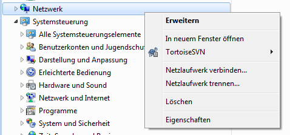
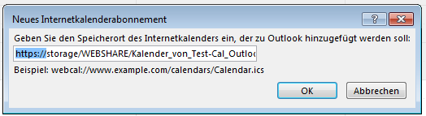

.. -*- coding: utf-8; mode: rst -*-

.. include:: ../apache_setup_refs.txt

.. _xref_webdav_clients:

================================================================================
                                 WebDAV-Clients
================================================================================

Hier ein paar Beispiele für Client Anwendungen des `WebDAV (wiki)`_ Servers, wie
er in :ref:`xref_site_webshare` eingerichtet wird.

.. caution::

   Auch wenn in den folgenden Abschnitten unter Umständen über das Sharen von
   Kalendern gesprochen wird, so ist dies NOCH KEINE `CalDAV (wiki)`_ Anwendung!
   `WebDAV (wiki)`_ und `CalDAV (wiki)`_ dürfen an dieser Stelle nicht
   verwechselt werden.

   * `CalDAV (wiki)`_ ist eine *Calendaring Extensions to WebDAV* siehe :rfc:`4791`.

cadaver webDAV-Client
=====================

Mit dem Debian-Paket :deb:`cadaver` steht der gleichnamige webDAV Client
:man:`cadaver` zur Verfügung:

* cadaver - A command-line WebDAV client for Unix.

Hier ein Beispiel für einen Test auf der Kommandozeile mittels ``cadaver``::

   cadaver https://localhost/WEBSHARE

   WARNING: Untrusted server certificate presented for `kaveri':
   Issued to: kaveri
   Issued by: kaveri
   Certificate is valid from Wed, 27 Jan 2016 00:32:35 GMT to Sat, 24 Jan 2026 00:32:35 GMT
   Do you wish to accept the certificate? (y/n) y
   Authentication required for webShare on server `kaveri':
   Username: user
   Password:

Ist man eingelogt, kann man z.B. das ``ls`` Kommando im webDAV Client absenden::

   dav:/WEBSHARE/> ls
   Listing collection `/WEBSHARE/': succeeded.
           .DS_Store                           6148  Apr 13  2015
           ._.DS_Store                         4096  Apr 13  2015
           README                               138  Jan 27 15:39

Andere Beispiele für Kommandos::

   dav:/WEBSHARE/> cat README
   Displaying `/WEBSHARE/README':

   ========================
   webShare / webDAV Ordner
   ========================

   Die Dateien in diesem Ordner werden über Apache exportiert.
   dav:/WEBSHARE/> exit

MS-Windows Datei Explorer
==========================

In dem Windows-Datei-Explorer können WebDAV Freigaben eingebunden werden, dies
kann man über die Kommandozeile machen:

.. code-block:: bat

   C:\Users\user>y:
   Das System kann das angegebene Laufwerk nicht finden.

   C:\Users\user>net use y: /delete 2>nul

   C:\Users\user>net use y: https://storage/WEBSHARE /user:test_user
   Geben Sie das Kennwort für "test_user" ein, um eine Verbindung mit "storage" herzustellen:
   Der Befehl wurde erfolgreich ausgeführt.

   C:\Users\user>dir y:
    Volume in Laufwerk Y: hat keine Bezeichnung.

    Verzeichnis von Y:\

   16.02.2016  15:04    <DIR>          .
   16.02.2016  15:04    <DIR>          ..
   12.02.2016  13:32               138 README
   16.02.2016  14:57                 0 Kalender_von_Test-Cal_Outlook_2013.ics
   ...

Alternativ kann man im Kontext-Menü des Datei-Explorers den Menüpunkt
"Netzlaufwerk Verbinden" auswählen.

1. "Netzlaufwerk Verbinden" aufrufen:

.. _xref-figure-webdav_clients-WebDAV_explorer_connect_net_drive:

   MS-Datei Explorer: Netzlaufwerk Verbinden

2. WebDav https:// Adresse angeben und Laufwerksbuchstaben zuordnen:

.. _xref-figure-webdav_clients-WebDAV_explorer_mount_https:

.. figure:: webdav_clients/WebDAV_explorer_mount_https.png
   :alt:     Figure (WebDAV_explorer_mount_https.png)
   :align:   center

   Netzlaufwerk https://<hostname>/WEBSHARE

3. Anmeldung durchführen.

.. _xref-figure-webdav_clients-WebDAV_explorer_mount_https_login_dialog:

.. figure:: webdav_clients/WebDAV_explorer_mount_https_login_dialog.png
   :alt:     Figure (WebDAV_explorer_mount_https_login_dialog.png)
   :align:   center

   Benutzer-Name und -Kennwort eingeben

4. Netzlaufwerk wurde eingehängt:

.. _xref-figure-webdav_clients-WebDAV_explorer_WEBSHARE_mount:

.. figure:: webdav_clients/WebDAV_explorer_WEBSHARE_mount.png
   :alt:     Figure (WebDAV_explorer_WEBSHARE_mount.png)
   :align:   center

   Der eingehängte ``WEBSHARE`` Ordner

Outlook
=======

Veröffentlichung eines Kalenders
---------------------------------

Einrichten der Veröffentlichung eines Kalenders, der in Outlook gepflegt wird
und regelmäßig auf einem WebDAV-Share veröffentlicht wird.

1. Outlook 2013 // Kalender // Start (Reiter)

2. *Online Veröffentlichen* (Freigeben)

3. *Auf WebDAV Server veröffentlichen*

.. _xref-figure-webdav_clients-WebDAV_Outlook_share_cal:

.. figure:: webdav_clients/WebDAV_Outlook_share_cal.png
   :alt:     Figure (WebDAV_Outlook_share_cal.png)
   :align:   center

   Kalender auf senutzerdefinierten Server veröffentlichen.

4. *Ort* ``https://storage/WEBSHARE/Calendar``

   Für den Ort zum veröffentlichen von Kalendern sollte sinnvollerweise ein
   eigener Ordner eingerichtet werden. Im einfachsten Fall ist das der
   Unterordner ``Calendar`` in dem Ordner ``/share/WEBSHARE`` (s.o.).

5. *Zeitspanne* : nach Möglichkeit **Vollständiger Kalender** anwählen.

   Merkwürdiger Weise kann man das aber nicht bei jedem Kalender auswählen
   (???keine Ahnung was der Quatsch soll, ist aber manchmal so in Windows???) ,
   dann wählt man hald "+/- 90 Tage" ... was besseres fällt mir da auch nicht
   ein.

6. *Detail* : **Alle Details** veröffentlichen

.. _xref-figure-webdav_clients-WebDAV_Outlook_share_cal_settings:

.. figure:: webdav_clients/WebDAV_Outlook_share_cal_settings.png
   :alt:     Figure (WebDAV_Outlook_share_cal_settings.png)
   :align:   center

   Automatische Uploads aktivieren.

Abonieren eines öffentlichen Kalenders
--------------------------------------

Einrichten eines Abonnements in Outlook:

1. Outlook 2013 // Kalender // Start (Reiter)
2. *Kalender Öffnen* (Kalender verwalten)
3. *Aus dem Internet*

.. _xref-figure-webdav_clients-WebDAV_Outlook_add_cal_from_internet:

.. figure:: webdav_clients/WebDAV_Outlook_add_cal_from_internet.png
   :alt:     Figure (WebDAV_Outlook_add_cal_from_internet.png)
   :align:   center

   Kalender aus dem Internet abonieren.

3. *Speicherort*  ``https://storage/WEBSHARE/Kalender_von_Test-Cal_Outlook_2013.ics``

.. _xref-figure-webdav_clients-WebDAV_Outlook_add_cal_from_internet_url:

   URL eingeben

4. *"Möchten Sie ... hinzufügen und abonnieren?"*  JA

  Für das Login und Passwort verwendet man sein Systemlogin (z.B. "test_user").

.. caution::

   Outlook ist immer etwas *bockig*, mal funktioniert was in der einen Version,
   mal was in der anderen Version oder auch mal gar nicht, manchmal hat es mit
   den Internetoptionen zu tun, manchmal muss man es "so" machen, das andere mal
   "so" usw. usw. ... das alles nervt einfach nur, man kann da keine brauchbare
   Hilfestellung geben, man muss sich da jedesmal bekloppt klickern bis man
   einen Weg gefunden hat.

Folgend ein paar Erfahrungswerte.

   Outlook verwendet statt *https://* als Protokoll für den *Speicherort* auch
   *webcals://*. So soll man beispielsweise über *webcals://...* den Kalender
   abonnieren. Ich musste *https://* angeben, dann hat es meistens funktioniert.

   In den Einstellungen des veröffentlichten Kalenders kann man zwar den
   Dateinamen in der URL ändern, aber das führt nur dazu, dass Outlook bei mir
   rumspinnt und am Ende nichts veröffentlicht.

   Wenn man den Namen eines (lokalen) Kalenders ändert (unter
   Eigenschaften/Allgemein) dann verliert Outlook den Bezug zu der
   veröffentlichten Kalenderdatei. Die alte Datei bleibt im webDAV gespeichert
   und es taucht eine neue Datei gleichen Inhalts nur mit dem neuen Namen
   auf. Das nervt alles furchtbar, weil Outlook dann auch noch anfängt über die
   selbstgemachten Probleme zu stolpern. Am besten ist, man logt sich via ssh
   ein und löscht überflüssige Dateien aus dem Ordner
   ``/share/WEBSHARE/Calendar/``::

     $ sudo rm /share/WEBSHARE/Calendar/xyz.ics

