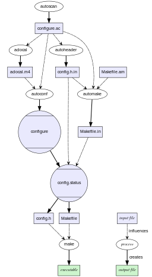

.. -*- coding: utf-8; mode: rst -*-

.. include:: ../ubuntu_install_pkgs_refs.txt

.. _xref_ubuntu_devTools:

================================================================================
                               Entwickler Pakete
================================================================================

Auch als Nicht-Entwickler benötigt man einige der Entwickler Pakete sobald
Software installiert wird, die nicht als *Binary* vorliegt und in irgendeiner
Form kompiliert werden muss. Sobald man bei einem Installationsprozess ``make``
eintippen muss, kann man sicher sein, dass ein -- wie auch immer gearteter --
Build-Prozess damit angestoßen wird, für den ein minimaler Satz an Build-Tools
benötigt wird. Die Build-Tools werden auch `Toolchain (wiki)`_ genannt.

Software Build (GNU)
====================

Es gibt eine Vielzahl von Buildtools die *hier* nicht installiert werden und auf
die nicht eingegangen werden soll. In Linux/Unix Software-Projekten wird jedoch
häufig die Tool-Chain des `GNU Build System (wiki)`_ genutzt, weshalb diese
*hier* installiert wird und mit ein paar Sätzen unten stehend kurz erläutert
werden soll.

In den angesprochenen Linux/Unix Software-Projekten sind für den Build-Prozess
neben der Toolchain noch (Standard-) Bibliotheken (z.B. `glibc`_) und deren
`Header Dateien (wiki)`_ erforderlich. In den Software-Projekten können diese
Abhängigkeiten ganz individuell sein. Es lässt sich aber auch ein **Subset von
Abhängigkeiten** identifizieren, der häufig benötigt wird.  Neben diesen Subset
an Abhängigkeiten sind die hier vorgestellten Entwickler Pakete eine
willkürliche Auswahl.

* :deb:`build-essential`
* :deb:`linux-headers-generic`

Das :deb:`build-essential` Paket installiert einen minimalen Satz von Tools und
Bibliotheken, der benötigt wird um Software zu kompilieren (s.o.). Zu diesem
minimalen Satz gehören beispielsweise die

* GNU Compiler Collection (`GCC`_) und die
* GNU C Library (`glibc`_), die Implemntierung der `C standard library (wiki)`_
  von GNU.

In dem :deb:`linux-headers-generic` Paket sind die Linux `Header Dateien
(wiki)`_, auch diese werden des öfteren benötigt und sollten installiert werden.
Viele Linux/Unix Software-Projekte bauen auf dem `GNU Build System (wiki)`_ auf,
das unter Debian/Ubuntu mit den folgenden Paketen installiert werden kann.

* :deb:`autoconf` / :deb:`autotools-dev`

Installiert (u.a.) die Tools :man:`autoscan`, :man:`autoconf` und
:man:`autoheader`. Diese Tools gehören zur `GNU autoconf`_ Suite mit der
Konfiguratinen erzeugt werden, die es Entwicklern erlauben ihre
Implementierungen *portabel* zu halten, so dass diese auf unterschiedlichen
(z.B. Unix/Linux) Platformen kompiliert werden können.

* :deb:`automake`

`GNU automake`_ ergänzt das Autotool Suite und ermöglicht es, die für den
Build-Prozess zuständigen ``Makefile`` Dateien ebenfalls *portabel* zu halten.
Das Zusammenspiel von Automake und Autoconf wird in dem Prozessbild von
Wikimedia Commons anschaulich dargestellt.

.. _xref-figure-devTools-256px-Autoconf-automake-process.svg:

   Autoconf / Automake Prozessbild (Wikimedia Commons)

Eine kurze, pragmatisches Einführung zu den Autotools gibt das `Autotools
Tutorial for Beginners (markuskimius)`_ oder das Kapitel "Build-Systeme Teil 5:
GNU Autotools" im `magazin.c-plusplus.net`_.

* :deb:`libtool-bin`

Das Paket :deb:`libtool-bin` installiert (u.a.) das Kommando :man:`libtools` das zu
dem GNU Portable Library Tool (kurz: `GNU libtool`_) gehört. Libtool unterstützt
bei der Erzeugung einer *portablen* (nicht auf eine Platform begrenzten) `Shared
Library (wiki)`_.

* :deb:`gettext`

Das Paket :deb:`gettext` installiert die `GNU gettext`_ Toolchain.  Das
Zusammenspiel der gettext-Tools wird in dem Prozessbild von Wikimedia Commons
anschaulich dargestellt.

.. _xref-figure-devTools-206px-Gettext.svg:

.. figure:: devTools/206px-Gettext.svg.png
   :alt:     Figure (206px-Gettext.svg.png)
   :align:   center
   :target:  https://de.wikipedia.org/wiki/GNU_gettext#/media/File:Gettext.svg

   `GNU gettext (wiki)`_ Prozessbild (Wikimedia Commons)

Debian
======

Alle `Debian-Derivate (wiki)`_ benutzen die Debian Toolchain der Paketverwaltung
bei der Software mittels deb-Pakete (``.deb``) installiert wird, siehe `Debian
Paket (wiki)`_. Dabei gibt es zum einen deb-Pakete in denen die *Binaries* sind
und zum anderen deb-Pakete in denen die *Sourcen* zu einer Software enthalten
sind. Die *Binary* Pakete sind für jede Hardware speziefisch kompilierte
*Sourcen* (meist 32Bit und 64Bit Varianten). Die *Source* Pakete sind immer die
gleichen. Mit einen deb-Paket kann ein Programmpaket installiert werden (`Debian
Package`_).

Um mehrere Pakete zu verwalten und ein Update-Verfahren anzubieten wird ein
Paketmanager benötigt, siehe auch `Paketverwaltung (wiki)`_. Als Paketmanager
kommt bei den Debian-Derivaten `APT (wiki)`_ zur Anwendung.  Eine Übersicht über
die Paketverwaltung von Debian ist in dem `Debian Package Managment`_ Artikel zu
finden.  Ein Paketmanager bezieht seine Pakete aus einem Reposetory, bei APT
werden die Reposetories beispielsweise in den Dateien unter
``/etc/apt/sources.list[.d/*]`` registriert. Zu einer vollständigen
Paketverwaltung gehören aber noch weitere Bestandteile, so bedarf es z.B. einer
Konfigurationsverwaltung mit der die Konfiguration einer Installation gemanaged
werden kann. Bei Debian übernimt :man:`debconf-devel` die
Konfigurationsverwaltung. Pakete wie :deb:`debconf` oder :deb:`apt` brauchen
nicht installiert werden, da sie Teil des Debian Ökosystems sind, sind sie
bereits auf jeder OS-Installation enthalten. Ergänzend können noch die folgenden
Pakete empfohlen werden.

* :deb:`devscripts`

Mit dem :deb:`devscripts` werden eine Reihe von Tools installiert, die bei der
Paketerzeugung und Introspektion hilfreich sind.

* :deb:`dkms`

Mit dem :deb:`dkms` werden die Tools für einen dynamischen Support von
Kernelmodulen installiert. Kernelmodule wie z.B. Treiber müssen mit jedem Update
des Kernels neu kompiliert werden, mit dem *Dynamic Kernel Module Support* `DKMS
(archlinux)`_ erfolgt das automatisch nach jedem Kernel-Update.

Edit, Diff & Merge
==================

Für das Arbeiten mit Sourcen (und dem handsOn Konfigurationen / siehe
:ref:`xref_get_started_concept`) ist ein minimaler Satz an Werkzeugen
erforderlich. Dazu gehören mindestens ein Editor, ein Tool zum *Durchsuchen* von
Ordnern und Dateien (nach Mustern) sowie ein diff- und ein patch-Tool.

* :deb:`emacs`

Man muss nicht den Emacs nehmen, es gibt *gefühlt* hundert andere Editoren, aber
der `GNU Emacs`_ passt einfach super in das Linux / GNU Ökosystem und kann
ansonsten auch nur empfohlen werden.

* :deb:`colordiff`
* :deb:`diff`

Für das Anzeigen von Unterschieden in Dateien und Ordnerstrukturen eigent sich
:man:`diff` oder das *farbige* :man:`colordiff`.

* :deb:`patch`

Die mit :man:`diff` erzeugten Differenzen können mit :man:`patch` wieder
eingespielt werden, siehe auch `Patch (wiki)`_.

* :deb:`grep`

Mit den `GNU grep`_ können `reguläre Ausdrücke (wiki)`_ in einzelnen Dateien
(:man:`grep`) oder in ganzen Ordnerstukturen (:man:`rgrep`) gesucht werden.

* :deb:`findutils`

In dem :deb:`findutils` sind die Tools :man:`find` und :man:`xargs` enthalten,
mit denen Dateien oder Ordner gesucht werden können (find) und auf die dann
Kommandos angewendet werden können (xargs).

Python
======

* :deb:`python-dev`
* :deb:`python-argcomplete`
* :deb:`python-pip`
* :deb:`python-virtualenv`
* :deb:`pylint`

Versionsverwaltung
==================

* :deb:`git`
* :deb:`subversion`
* :deb:`mercurial`
* :deb:`bzr`

Datenbanken
===========

* :deb:`sqlite3`
* :deb:`sqlitebrowser`

Installation
============

.. code-block:: bash

   $ sudo ${SCRIPT_FOLDER}/ubuntu_install_pkgs.sh devTools
