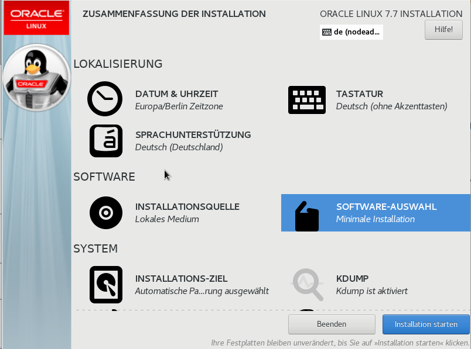
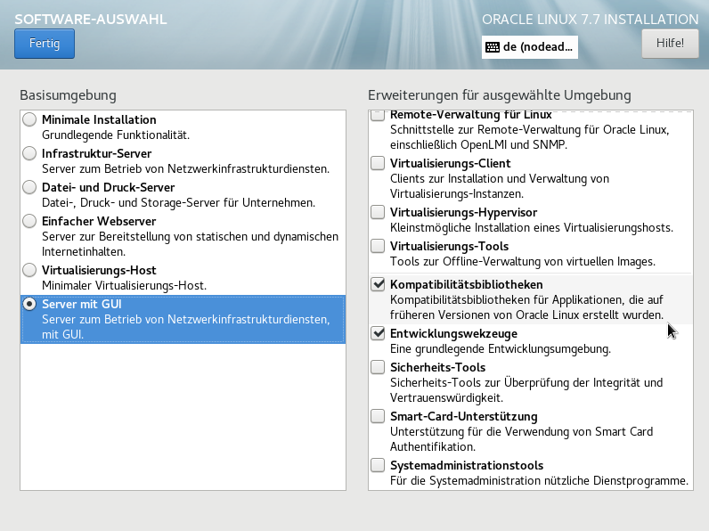
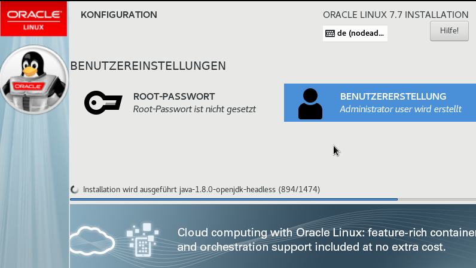
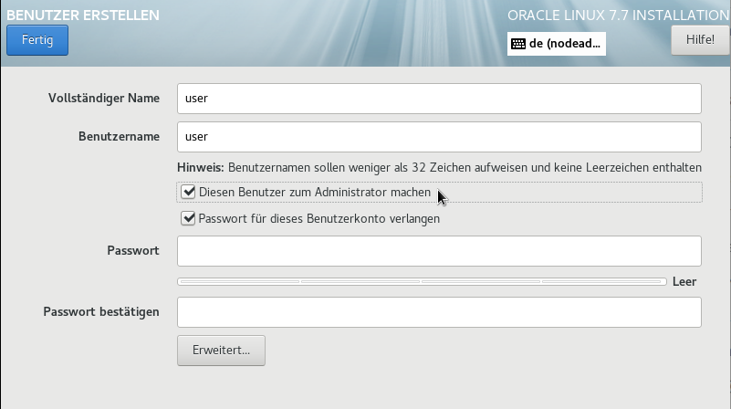
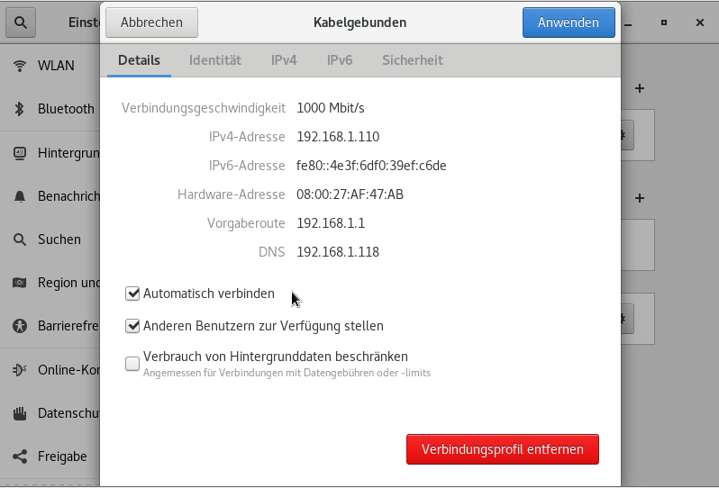

.. -*- coding: utf-8; mode: rst -*-
.. include:: ../oracle_refs.txt

.. _oracle_linux:

=======================
Oracle Linux einrichten
=======================

.. _ORA-19c-PRE:
   https://docs.oracle.com/en/database/oracle/oracle-database/19/ladbi/overview-of-oracle-linux-configuration-with-oracle-rpms.html#GUID-693599D4-BD32-4E6A-9689-FA7D1CD75653

.. sidebar:: Entwickler Szenarien

   Die hier beschriebene Oracle Installation ist lediglich für *Entwickler -
   Zwecke* geeignet.  Backups, Updates und andere Anforderungen werden nicht
   berücksichtigt.  Für die Nutzung in *produktiven* Umgebungen werden die
   entsprechenden Lizenzen von Oracle benötigt.

In dieser Anleitung wird eine `Oracle Linux`_ Distribution in einer VirtualBox_
installiert.  Aufgrund der Virtualisierung werden noch ein paar zusätzliche
Schritte erforderlich, die in einer *normalen* Installation nicht erforderlich
wären.

Die Boot Medien für die OL_ Versionen werden über die `Oracle Software
Delivery`_ bezogen, dort in der Suche einfach *linux* eintippen und folgendes
für den Download auswählen: Aktuell ist OL8_ (siehe `Announcing
<https://blogs.oracle.com/linux/announcing-the-release-of-oracle-linux-8>`_)
aber selbst Oracle empfiehlt aktuell (im Okt. 2019) noch ein OL7_ für die 19c
Installation [ORA-19c-PRE_]

- **aktuelles OL7** ISO: ``V983339-01.iso``

  Oracle Linux Release 7 Update 7 for x86 (64 bit), 4.4 GB (oder eine aktueller
  Version nehmen dann ist der Name des ISO anders).

- **aktuelles OL8** ISO: ``V983280-01.iso``

  Oracle Linux Release 8 Update 0 for x86 (64 bit), 6.6 GB

Oracle Database Setup Wizard
=============================

Es muss über das Image gebootet werden, dann erscheint der Oracle Database Setup
Wizard:

In dem Wizard sollte man die ansonsten *Minimale Installation* noch um folgendes
erweitern (Server mit GUI. Kompatibilität und Entwickler Werkzeuge).

Es empfiehlt sich einen Benutzer mit Admin Rechten (sudo) einzurichten:

Die Installation dauert dann erst mal eine Weile, danach erfolgt ein Reboot.
Nach dem ersten Boot muss man noch das *ORACLE LINUX LICENSE AGREEMENT* (EULA)
akzeptieren und die Konfiguration erstellen.  Mit dem oben eingerichteten
Benutzer kann man sich am System anmelden und das System-Setup vervollständigen.

Sollte im System die Netzwerkverbindung noch nicht aktiv sein, muss sie über
:menuselection:`Netzwerkeinstellungen` aktiviert werden. In den *Details* sollte
man noch einstellen, dass die Verbindung nach einem Boot automatisch wieder
hergestellt wird.

.. figure:: Netzwerkeinstellungen.png
   :alt: Figure (Netzwerkeinstellungen.png)
   :scale: 50%
   :align: center

Hostname ändern
===============

.. sidebar:: iptables

   Auf einer Standard Installation des OL7 ist :man:`iptables` aktiv.  Will man
   sich von Remote verbinden, müsste man diese noch (für den Listner auf TCP
   Port 1521) einrichten.  Oder man deinstalliert die :man:`iptables` ganz::

     $ sudo yum remove iptables

.. _Update the System Hostname: https://docs.oracle.com/en/operating-systems/oracle-linux/8/obe-hostname-cli/index.html

Der Hostname des Rechners kann mit dem Befehl :man:`hostnamectl` angepasst
werden (`Update the System Hostname`_)::

  $ sudo hostnamectl set-hostname dbhost.mydomain.de
  ...
  $ $ hostnamectl
   Static hostname: dbhost.mydomain.de
         Icon name: computer-vm
           Chassis: vm
        Machine ID: e533f125fc31419f9323fae48fe0b91e
           Boot ID: 4156c97937e3472299e2b71a6f9b2c5d
    Virtualization: kvm
  Operating System: Oracle Linux Server 7.7
       CPE OS Name: cpe:/o:oracle:linux:7:7:server
            Kernel: Linux 4.14.35-1902.5.2.2.el7uek.x86_64
      Architecture: x86-64

OS update
=========

Das *so* installierte System sollte erst mal aktualisiert werden, danach nochmal
ein Reboot.  Ggf. installiert man sich bei der Gelegenheit auch gleich noch ein
paar Entwickler Tools::

  $ sudo yum update
  ...
  # Entwickler Tools / nur exemplarisch ..
  $ sudo yum install java-1.8.0-openjdk-devel emacs git
  ...
  $ sudo reboot

VirtualBox Additions
====================

.. _VirtualBoxAdditions: https://www.virtualbox.org/manual/ch04.html

Wurde die Installation in einem VirtualBox_ Gast System vorgenommen, so sollte
man sich gleich noch die `VirtualBoxAdditions`_ installieren.  Dafür müssen
mindestens folgende Pakete im System installiert sein ::

  $ sudo yum install gcc kernel-devel kernel-headers dkms make bzip2 perl

In dem *so* vorbereiteten System kann nun das ``VirtualBoxAdditions.iso`` in das
CD Laufwerk *eingelegt* werden.  Sofern man danach nicht eh schon in einem
Dialog gefragt wird, ob man das *ISO starten will*, muss man die Installation
über folgende Kommandos durchführen.  Die damit installierten Kernel Module
können erst nach einem Reboot genutzt werden::

  $ sudo -i
  $ export KERN_DIR=/usr/src/kernels/`uname -r`
  $ cd /run/media/$(whoami)/VBox_GAs_<version>
  ./VBoxLinuxAdditions.run
  ...
  reboot

.. admonition::  GRUB Menü

   Beim Boot wird über GRUB eine Auswahl an Kernel angeboten.  Die hier
   vorgestellte Installation hat die Guest-Addition (resp. die Kernel
   Module) lediglich für den *aktiven* Kernel installiert::

     $ sudo awk -F\' '/menuentry / {print $2}' /etc/grub2.cfg | grep $(uname -r)
     Oracle Linux Server (4.14.35-1902.5.2.2.el7uek.x86_64 with Unbreakable Enterprise Kernel) 7.7

Nach dem Reboot sollte der oben eingerichtete Benutzer noch der Gruppe
``vboxsf`` hinzugefügt werden, soll der ``oracle`` Benutzer auch Zugriff auf die
Shares haben, kann man ihn auch gleich der Gruppe hinzufügen::

  $ sudo usermod -aG vboxsf $(whoami)
  ...
  $ sudo usermod -aG vboxsf oracle

Danach muss der Benutzer nochmal ab- und wieder angemeldet werden, damit die
neue Gruppe auch *greift*.  Damit hat der Benutzer die Berechtigung auf die
*gemeinsamen Ordner* des Wirt-Systems zugreifen zu dürfen.  Diese können nun
eingerichtet werden.
