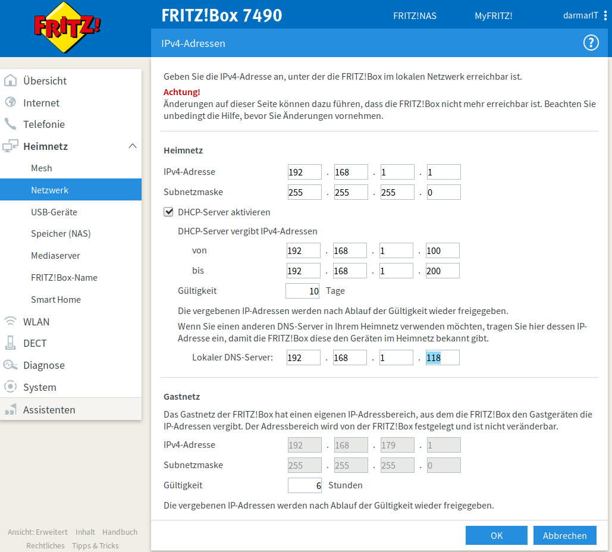

.. -*- coding: utf-8; mode: rst -*-

.. _Chaos Computer Club (DNS): https://www.ccc.de/de/censorship/dns-howto
.. _DHCP (wiki): https://de.wikipedia.org/wiki/Dynamic_Host_Configuration_Protocol
.. _DNS (wiki): https://de.wikipedia.org/wiki/Domain_Name_System
.. _DNS.WATCH: https://dns.watch/
.. _DNSSEC (wiki): https://de.wikipedia.org/wiki/Domain_Name_System_Security_Extensions
.. _Kuketz DNS Artikel: https://www.kuketz-blog.de/dns-unzensierte-und-freie-dns-server-ohne-protokollierung/
.. _Kuketz pi-hole Artikel: https://www.kuketz-blog.de/pi-hole-schwarzes-loch-fuer-werbung-raspberry-pi-teil1/
.. _pi-hole: https://pi-hole.net/

=======
pi-hole
=======

Die pi-hole_ ist ein lokaler `DNS (wiki)`_ Server, der Domain-Namen mit Werbung
und Trackern blockiert (nicht auflöst).  Kuketz hat zu den Hintergründen und zum
Einrichten einer solchen pi-hole einen umfassenden Artikel verfasst, siehe:
`Kuketz pi-hole Artikel`_

pi-hole und Fritz-Box
=====================

Hat man die pi-hole eingerichtet, steht der lokale DNS Dienst bereit und muss
nun noch den Clients resp. dem Router bekannt gemacht werden.  Die meisten
Router sind so eingerichtet, dass die Clients ihr Netzwerk-Setup via `DHCP
(wiki)`_ vom Router beziehen.  In dem `Kuketz pi-hole Artikel`_ werden im
Kapitel *"Einrichtung als DNS-Server"* drei alternative Varianten vorgestellt.

Bei **Variante 2 -- per DHCP** wird die pi-hole (also die IP des lokalen DNS) im
Rahmen des DHCP an die Clients weiter gereicht.  In der Fritz-Box unter:

- :menuselection:`Heimnetz -> Heimnetzübersicht -> Netzwerkeinstellungen ->
  IPv4-Adressen`

muss der DHCP-Server der Fritz-Box aktiviert sein und unter **Lokaler
DNS-Server** setzt man die IP der pi-hole.  Hier im Beispiel ist das die
``192.168.1.118``:

Nach bestätigen mit :guilabel:`OK` werden alle zukünftigen (DHCP) Verbindungen
als DNS die pi-hole verwenden.  Will man das sofort mal testen, muss man die
Netzwerkverbindung auf dem Client-Rechner kurz ab- und wieder anschalten (oder
neu booten).  Danach sollte im *NetworkManager* (s.a. Netzwerk-Einstellungen)
die IP des DNS angezeigt werden.  Auf der Linux Kommandozeile kann man dazu
z.B. :man:`nmcli` nachschauen::

  $ nmcli
  ...
  DNS configuration:
          servers: 192.168.1.118
          domains: fritz.box
          interface: enp3s0

  $ nmcli device show
  GENERAL.DEVICE:                         enp3s0
  ...
  IP4.ADDRESS[1]:                         192.168.1.127/24
  IP4.GATEWAY:                            192.168.1.1
  ...
  IP4.DNS[1]:                             192.168.1.118
  IP4.DOMAIN[1]:                          fritz.box

Damit die FritzBox auch die pi-hole als *bevorzugten DNSv4-Server* nutzt, muss
noch die Folgende Einstellung vorgenommen werden.

- :menuselection:`Internet -> Zugangsdaten -> DNS-Server`

.. figure:: pihole-FB-DNS-Server.png
   :alt:     Figure (pihole-FB-DNS-Server.png)
   :class:   rst-figure

Die IP der pi-hole hier im Beispiel ist ``192.168.1.1``.  Falls die mal ausfällt
wurde noch der `Chaos Computer Club (DNS)`_ als Alternative eingetragen
(s.a. `Upstream DNS Server`_)

Upstream DNS Server
===================

In der pi-hole kann man einstellen welche DNS Server die pi-hole verwenden soll.
In dem `Kuketz DNS Artikel`_ werden *Unzensierte und freie DNS-Server ohne
Protokollierung* vorgestellt.  Hier im Beispiel verwende ich DNS Server die
`DNSSEC (wiki)`_ unterstützen.

- DNS.WATCH_ IPv4::

    84.200.69.80
    84.200.70.40

- `Chaos Computer Club (DNS)`_ IPv4::

    194.150.168.168

.. warning::

   Die Option :guilabel:`Use DNSSEC` sollte nur verwendet werden, wenn alle
   *upstream* DNS-Server auch DNSSEC unterstützen!  Anderen Falles kommt es bei
   der Namensauflösung zu Problemen.  I.d.R. spürt man das sehr deutlich, da die
   pi-hole dann gar keine Namen mehr auflösen kann und von daher alle
   *blockiert*.

Um die lokalen Namen ebenfalls auflösen zu können empfiehlt es sich noch
:guilabel:`Use Conditional Routing` zu aktivieren und dort die IP der Fritz-Box
einzutragen.  Der Name der Fritz-Box im lokalem Netz ist ``fritz.box`` (sofern
man das in der FB nicht geändert hat), die IP hier im Beispiel ist
``192.168.1.1``.

.. figure:: pihole-settings-DNS.png
   :alt:     Figure (pihole-settings-DNS.png)
   :class:   rst-figure

Host-Namen aus Subnetzen
========================

In einer IP Infrastruktur mit Subnetzen (die z.B. über VPN angebunden sind) sind
die Host-Namen aus *anderen* Subnetzen nicht ohne weiteres auflösbar.

Der DNS der pi-hole nutzt die ``/etc/hosts`` Datei auf der pi-hole ebenfalls zur
Namensauflösung.  Eine einfache Lösung um Host-Namen im eigenen Subnetz bekannt
zu machen besteht deshalb darin, unbekannte Host-Namen in die ``/etc/hosts`` der
pi-hole direkt einzutragen.  Dazu meldet man sich an der pi-hole via ssh an
(hier im Beispiel ``192.168.1.118``) und editiert die hosts-Datei::

  ssh pi@192.168.1.118
  pi@192.168.1.118's password: ....

  $ sudo nano /etc/hosts

Meist steht am Anfang der ``/etc/hosts`` so was wie::

  127.0.0.1        localhost
  ::1              localhost ip6-localhost ip6-loopback
  ff02::1          ip6-allnodes
  ff02::2          ip6-allrouters

Hat man beispielsweise VPN Knoten könnte man diese ebenfalls hier eintragen::

  192.168.0.1      vpn.hamburg.local
  192.168.1.1      vpn.hannover.local
  192.168.2.1      vpn.bremen.local

Die Hosts mit den Anwendungen an entfernten Standorten trägt man ebenfalls ein::

  192.168.0.34     hamburg  app.hamburg.local
  192.168.1.120    hannover app.hannover.local
  192.168.2.124    bremen   app.bremen.local

Blocklists
==========

Die Blocklists kann man im Admin Inetrface der pi-hole ändern:

- :menuselection:`Settings --> Blocklists`

Hier noch ein paar Vorschläge für Blocklists::

  http://sysctl.org/cameleon/hosts
  http://vxvault.net/URL_List.php
  https://easylist-downloads.adblockplus.org/easyprivacy+easylist.txt
  https://easylist.to/easylistgermany/easylistgermany.txt
  https://fanboy.co.nz/r/fanboy-complete.txt
  https://filters.adtidy.org/extension/chromium/filters/11.txt
  https://filters.adtidy.org/extension/chromium/filters/14.txt
  https://filters.adtidy.org/extension/chromium/filters/3.txt
  https://filters.adtidy.org/extension/chromium/filters/6.txt
  https://filters.adtidy.org/windows/filters/11.txt?id=11
  https://filters.adtidy.org/windows/filters/15.txt
  https://github.com/crazy-max/WindowsSpyBlocker/blob/master/data/hosts/spy.txt
  https://hosts-file.net/ad_servers.txt
  https://mirror1.malwaredomains.com/files/justdomains
  https://phishing.army/download/phishing_army_blocklist_extended.txt
  https://ransomwaretracker.abuse.ch/downloads/RW_DOMBL.txt
  https://ransomwaretracker.abuse.ch/downloads/RW_URLBL.txt
  https://raw.githubusercontent.com/EnergizedProtection/block/master/ultimate/formats/hosts
  https://raw.githubusercontent.com/StevenBlack/hosts/master/hosts
  https://raw.githubusercontent.com/reek/anti-adblock-killer/master/anti-adblock-killer-filters.txt
  https://s3.amazonaws.com/lists.disconnect.me/simple_ad.txt
  https://s3.amazonaws.com/lists.disconnect.me/simple_tracking.txt
  https://www.squidblacklist.org/downloads/dg-malicious.acl
  https://zeustracker.abuse.ch/blocklist.php?download=domainblocklist

.. hint::

   Beim ersten Eintragen der/aller oben genannten Blocklists kann das Update
   nach der Bestätigung über :guilabel:`Save and Update` etwas länger dauern.
