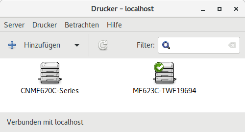
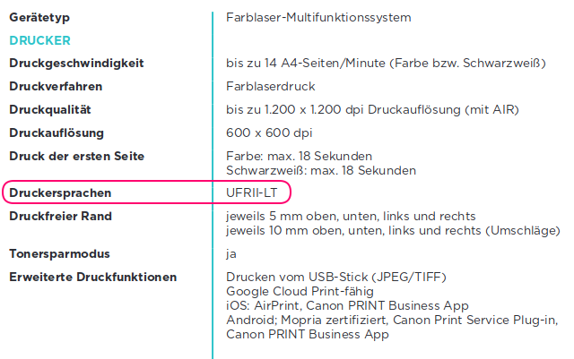

.. -*- coding: utf-8; mode: rst -*-
.. include:: ../print_scan_refs.txt

==============
Druckertreiber
==============

.. _driverless-printing:

driverless printing
===================

Über das `driverless-printing CUPS`_ müsste in einer Standard Installation des
Ubuntu (18.04) resp. Debian Desktop Systems (mit CUPS) einem der IPP fähige
Drucker bereits im Setup unter "Geräte" angeboten werden.  Alternativ kann man
dort auch auf *"Zusätzliche Druckereinstellungen"* drücken, womit dem das
Programm ``system-config-printer`` gestartet wird.

.. _figure-cups-system-config-printer-gui:

   ``system-config-printer``: CUPS GUI für Drucker- Konfiguration und
   Statusabfrage.

In dem Fenster kann man *"Hinzufügen"* klicken und über einen geführten Dialog
den Drucker einrichten.  Eine detallierte Anleitung findet man unter:
:ref:`printer_setup`.  Hier beim MF623Cn wurde der Drucker mit dem Treiber

- Für MF623Cn_ angepasste PPD: :origin:`CNMF620C Series, driverless (PPD
  modified) <docs/print_scan/CNMF620C-Series.ppd>`

eingerichtet.  Zu sehen im GNOME-Setup unter *Geräte/Drucker* und über einen
Klick auf *Zahnrad / Drucker-Details*.  Den *driverless* Drucker sollte man mal
testen.  Mit einem modernen PDF-fähigen Drucker (``application/pdf``) von einem
Hersteller, der IPP beherrscht wird man vermutlich schon respektable Erzeugnisse
anfertigen können.  Beim MF623Cn gibt es allerdings noch einige
Kinderkrankheiten.  In solchen Fällen gibt es zwei Möglichkeiten.

- man installiert sich den **proprietären** Druckertreiber (:ref:`canon_urf`)
  des Herstellers.

  Sofern für Linux vorhanden, kann man sich auch mal die Druck-Ergebnisse mit
  dem proprietären Treiber vom Hersteller anschauen (doch ACHTUNG:
  :ref:`driverless-vs-canon`).

- Man steigt etwas tiefer in die Materie `CUPS (wiki)`_ (-Filter) und
  ggf. IPP_ ein und richtet sich eine eigene `PPD (wiki)`_ ein.

  - :ref:`cupstestppd`
  - :ref:`cups-driverless_HWMargins`
  - :origin:`CNMF620C Series, driverless (PPD modified) <docs/print_scan/CNMF620C-Series.ppd>`

Mit `CUPS (wiki)`_ kann man für den physikalisch gleichen Drucker mehrere
unabhängige Drucker-Setups einrichten, so kann man beispielsweise ein
bestehendes Setup (siehe auch Kapitel :ref:`ppd_spec`) auch kopieren und dann
verändern.  Diese Drucker-Setups sind aus Sicht der Programme voneinander
unabhängige Drucker.  Man braucht also sein *funktionierendes* Setup erst mal
nicht *anfassen*, wenn man mal was ausprobieren möchte.

- `driverless-printing CUPS`_
- `Writing your own CUPS printer driver in 100 lines of Python
  <https://behind.pretix.eu/2018/01/20/cups-driver/>`_

.. _canon_urf:

MF620C-Serie URF-II (MF623Cn)
=============================

.. _figure-MF623Cn-printer-spec:

   MF623Cn_: technische Angaben

Die moderneren Canon Drucker unterstützen Ultra Fast Renderer (UFR) welches man
sich über einen **proprietären** Treiber auch auf dem PC installieren kann.  Die
Linux Treiber für die Drucker der MF620C Serie gibt es bei Canon:

- https://support-asia.canon-asia.com/contents/ASIA/EN/0100924010.html

Dort sind auch Installationsanleitungen gegeben, diesen sollte man **nicht**
folgen: **Die Linux Pakete von Canon sind schon immer dafür bekannt, diversen
Schrott zu installieren**.  Das gilt sowohl für die Druck- als auch für die
SCAN- Funktionen (Bitte auch :ref:`driverless-vs-canon` lesen).  Es empfiehlt
sich von daher nur die nötigsten Sachen (die binären Treiber und die PPDs) aus
dem Treiber-Download zu installieren und das ist auch ganz einfach: In den
``linux-UFRII-drv-v{xxx}-uken.tar.gz`` Archiven gibt es zwei, max. drei Pakete
die man installieren muss, mehr bitte nicht:

- ``cndrvcups-common_{4.10}-1_amd64.deb``
- ``cndrvcups-ufr2-uk_{3.70}-1_amd64.deb``
- ``cndrvcups-utility_{1.10}-1_amd64.deb`` (funktioniert i.d.R nicht)

Die ``.tar.gz`` Datei im Download-Ordner auspacken (über rechte Maustaste *"Hier
entpacken"*).  In dem dann angelegten Ordner muss man sich etwas nach unten
*durchklickern*: ``64-bit_Driver/Debian``.  Dort sieht man dann auch schon die
`Debian Pakete <https://de.wikipedia.org/wiki/Debian_Package_Manager>`_ mit der
Dateiendung ``.deb``.  Diese kann man mit eine *Doppelklick* einfach
installieren.

Leider ist die Installation damit nicht erledigt, da Canon seit jeher unfähig
ist, echte 64-bit Bibliotheken zu compilieren: in den mit ``amd64``
gekennzeichneten Paketen ist der *UFRII-Closed-Source-Treiber* in Form von
32-Bit Bibliotheken enthalten, die wiederum auf anderen 32-Bit Bibliotheken des
Betriebssystems aufbauen.  Welche aber auf dem (eigenen) 64-Bit Betriebssystem
i.d.R. nicht zu erwarten sind.

Normalerweise kann der Paket-Ersteller solche Abhängigkeiten in den ``.deb``
Dateien beschreiben und dann würde der Paket-Manager darauf reagieren können,
aber auch dazu ist Canon als Paket-Ersteller seit jeher nicht in der Lage.  Mit
dem Effekt, dass der Anwender mal wieder Blutdruck bekommt, weil *Drucken nicht
funktioniert*, es aber er auch keine hilfreichen Fehlermeldungen gibt.

Diese Abhängigkeiten zu den 32-Bit Bibliotheken müssen wir manuell installieren
(i.d.R. muss man das auch, wenn man die Installation-Anweisungen von Canon
befolgen würde).  Man installiert daher zuerst die benötigten 32-Bit
Bibliotheken::

  sudo apt-get install lib32stdc++6 libxml2:i386

Bei moderneren Druckern, sollte der Drucker nun automatisch gefunden und
eingebunden werden.  Falls das bei dem eigenen Drucker noch nicht klappt, sollte
man mit dem :ref:`printer_setup` fortfahren.

- Für MF623Cn_ angepasste PPD (URFII): :origin:`Canon MF620C Series UFRII LT
  <docs/print_scan/MF623C-TWF19694.ppd>`

.. _driverless-vs-canon:

Druckbild Canon VS driverless
=============================

Hier ein Vergleich des Druckbilds des All-in-One Drucker MF623Cn_, einmal mit
dem origignal :ref:`Canon URF-II Treiber <canon_urf>` (links) und dem
:ref:`driverless-printing <printer_setup>` (rechts).

.. _figure-MF620C-Series-driverless-vs-canon:

.. figure:: MF620C-Series-driverless-vs-canon.png
   :alt:     Figure (MF620C-Series-driverless-vs-canon.png)

   Druckbild MF620C Series: :ref:`Canon URF-II Treiber <canon_urf>` (links)
   :ref:`driverless-printing <printer_setup>` (rechts)

Das :ref:`oben gezeigt Bild <figure-MF620C-Series-driverless-vs-canon>` ist der
rechte-obere Ausschnitt eines A4-Drucks, bei dem oben in der Ecke ein `QR-Code
(wiki)`_ war.  Links sieht man, dass der Original Canon Treiber zwar bis in die
Ecken druckt aber den QR-Code im PDF nur zerstört ausdruckt.  Bei genauerer
Betrachtung (nicht im Bild zu erkennen) stellt man auch fest, dass der original
Treiber nicht farbecht ist.

Der Druck über den Drucker des :ref:`driverless-printing <printer_setup>` zeigt
das Problem, dass er nicht bis in die Ecken drucken kann, dafür wird aber der
QR-Code nicht zerstört (was manchmal wichtiger sein kann).  Bei genauerer
Betrachtung (nicht im Bild zu erkennen) hat man den Eindruck, dass der Druck
Farbecht ist, jedoch scheint die Auflösung und Farbtiefe nicht ganz ausgereizt
zu werden.

.. hint::

   Der Rand beim *driverless* Druck konnte durch setzten der Rahmen des
   ``ImageableArea`` auf ``0 0 ...`` korrigiert werden (siehe
   :ref:`cups-driverless_HWMargins`).

Debug LOG der Druckerzeugnisse
==============================

Debug-LOG für den :ref:`driverless-printing <printer_setup>` Druck (rechts)::

  D [11/Feb/2019:14:39:00 +0100] [Job 82] 4 filters for job:
  D [11/Feb/2019:14:39:00 +0100] [Job 82] pdftopdf (application/pdf to application/vnd.cups-pdf, cost 66)
  D [11/Feb/2019:14:39:00 +0100] [Job 82] gstoraster (application/vnd.cups-pdf to image/pwg-raster, cost 99)
  D [11/Feb/2019:14:39:00 +0100] [Job 82] - (image/pwg-raster to printer/CNMF620C-Series/image/pwg-raster, cost 0)
  D [11/Feb/2019:14:39:00 +0100] [Job 82] - (printer/CNMF620C-Series/image/pwg-raster to printer/CNMF620C-Series, cost 0)
  D [11/Feb/2019:14:39:00 +0100] [Job 82] job-sheets=none,none
  D [11/Feb/2019:14:39:00 +0100] [Job 82] argv[0]="CNMF620C-Series"
  D [11/Feb/2019:14:39:00 +0100] [Job 82] argv[1]="82"
  D [11/Feb/2019:14:39:00 +0100] [Job 82] argv[2]="markus"
  D [11/Feb/2019:14:39:00 +0100] [Job 82] argv[3]="8B653235.pdf"
  D [11/Feb/2019:14:39:00 +0100] [Job 82] argv[4]="1"
  D [11/Feb/2019:14:39:00 +0100] [Job 82] argv[5]="InputSlot=Auto print-content-optimize=auto PageSize=A4 number-up=1 MediaType=Auto noCollate print-scaling=auto ColorModel=RGB job-uuid=urn:uuid:81164725-dc83-35d0-4be7-2588d85eefc4 media=0 job-originating-host-name=localhost date-time-at-creation= date-time-at-processing= time-at-creation=1549892340 time-at-processing=1549892340"
  D [11/Feb/2019:14:39:00 +0100] [Job 82] argv[6]="/var/spool/cups/d00082-001"

Debug-LOG für den :ref:`Canon URF-II Treiber <canon_urf>` Druck (links)::

  D [11/Feb/2019:14:32:00 +0100] [Job 81] 3 filters for job:
  D [11/Feb/2019:14:32:00 +0100] [Job 81] pdftopdf (application/pdf to application/vnd.cups-pdf, cost 66)
  D [11/Feb/2019:14:32:00 +0100] [Job 81] pdftops (application/vnd.cups-pdf to application/vnd.cups-postscript, cost 100)
  D [11/Feb/2019:14:32:00 +0100] [Job 81] pstoufr2cpca (application/vnd.cups-postscript to printer/MF623C-TWF19694, cost 0)
  D [11/Feb/2019:14:32:00 +0100] [Job 81] job-sheets=none,none
  D [11/Feb/2019:14:32:00 +0100] [Job 81] argv[0]="MF623C-TWF19694"
  D [11/Feb/2019:14:32:00 +0100] [Job 81] argv[1]="81"
  D [11/Feb/2019:14:32:00 +0100] [Job 81] argv[2]="markus"
  D [11/Feb/2019:14:32:00 +0100] [Job 81] argv[3]="8B653235.pdf"
  D [11/Feb/2019:14:32:00 +0100] [Job 81] argv[4]="1"
  D [11/Feb/2019:14:32:00 +0100] [Job 81] argv[5]="noCNDraftMode BindEdge=Left OutputBin=Auto number-up=1 noCollate CNBarCodeMode=None PageSize=A4 InputSlot=Auto CNSpecialSmooth=Mode1 CNColorMode=color CNColorHalftone=Resolution MediaType=Auto CNHalftone=Resolution job-uuid=urn:uuid:1fb4ea86-8cb1-380d-60a9-4f211deae89e print-quality=3 job-originating-host-name=localhost date-time-at-creation= date-time-at-processing= time-at-creation=1549891920 time-at-processing=1549891920 cupsPrintQuality=Draft"
  D [11/Feb/2019:14:32:00 +0100] [Job 81] argv[6]="/var/spool/cups/d00081-001"

