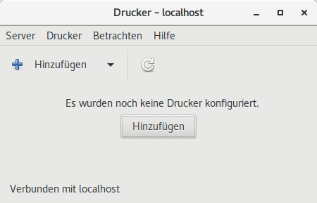
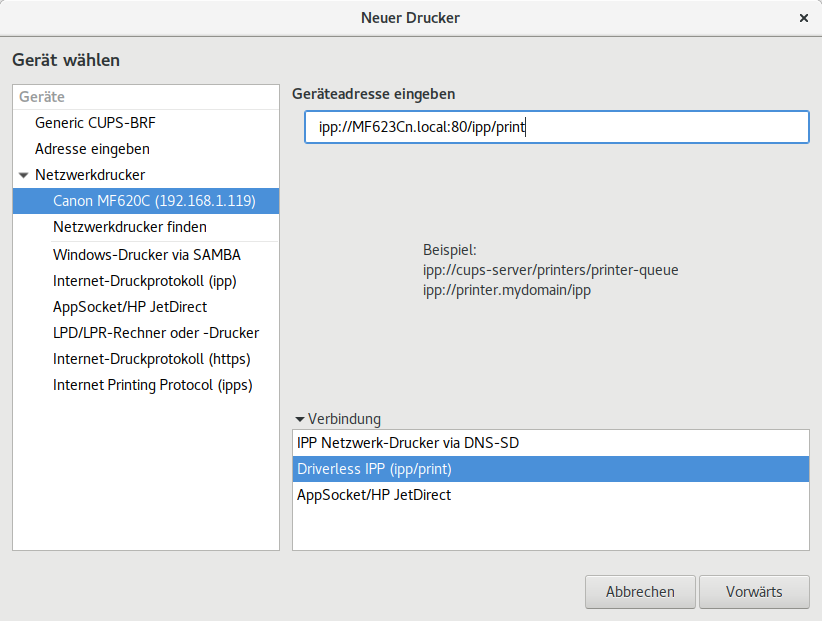
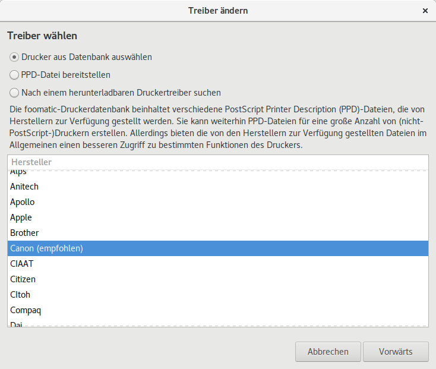
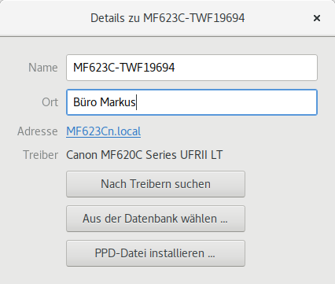

.. -*- coding: utf-8; mode: rst -*-
.. include:: ../print_scan_refs.txt

.. _printer_setup:

======================
Netzwerk-Drucker Setup
======================

Im GNOME-Setup unter :guilabel:`Geräte/Drucker` kann man den Drucker einrichten,
i.d.R. wird der Drucker im Netz gefunden, i.d.R: wählt GNOME (resp CUPS) die
**driverless** PPA, bei mir (Ubuntu 18.04 und MF623Cn Drucker) war das:

- :origin:`CNMF620C Series, driverless, cups-filters <docs/print_scan/CNMF620C-Series.ppd>`

Über den Button :guilabel:`Zusätzliche Druckereinstellungen` kann man bestehende
Setups ändern oder weitere Setups einrichten.  Die GUI
:ref:`system-config-printer <figure-cups-system-config-printer-gui>` ist die
Druckerverwaltung des CUPS.  Alternativ kann diese auch im WEB Browser unter
http://localhost:631/printers über HTML Formulare vorgenommen werden.  Über die
(HTML) GUI können nur bestimmte Benutzer die Drucker verwalten. Nur die, die zur
Gruppe lpadmin gehören::

   $ members lpadmin
   cups-pk-helper <benutzername> <benutzername> ...

Die GNOME GUI's nutzen zum Teil den Benutzer ``cups-pk-helper`` aus dem
gleichnamigen APT-Paket, allerdings auch nicht immer, weshalb man sich selbst am
besten noch zu der Gruppe ``lpadmin`` hinzufügt::

  $ sudo gpasswd -a <benutzername> lpadmin

Auch wenn es immer eine HTML-GUI gibt, am übersichtlichsten ist die GNOME GUI
(siehe :ref:`figure-cups-system-config-printer` &
:ref:`figure-cups-system-config-printer-gui`).

.. _figure-cups-system-config-printer:

   ``system-config-printer``: CUPS Drucker-Setup auf dem ``localhost``

Über :menuselection:`Hinzufügen --> Netzwerkdrucker` den Drucker suchen lassen
und dann als Verbindung ``ipp/print`` auswählen (sicherstellen, dass oben die
Geräteadresse mit ``ipp://`` beginnt).

   CUPS: Drucker-Verbindung über IPP

.. note::

   Hier noch Verweise zu den anderen ggf. zur Verfügung stehenden Protokollen:
   `DNS-SD aka AirPrint aka Bonjour
   <https://wiki.debian.org/PrintingGlossaryandIndex#dnssd>`_ & `AppSocket
   Protocol (aka JetDirect) <https://www.cups.org/doc/network.html#SOCKET>`_

Nun muss man einen eindeutigen Druckernamen vergeben, diesen wird man später
nicht mehr ändern können.  Ich verwende hierfür die genaue Typ-Bezeichnung plus
die Seriennummer.  Als Beschreibung wähle ich *"Farb-Laser A4 einseitig"* und
bei Ort gebe ich das Büro an / z.B.:

=================   ==========================
Druckername (ID)    ``MF623C-TWF19694``
Beschrebung         *Farb-Laser A4 einseitig*
Ort                 *Büro Markus*
=================   ==========================

Danach kann man auf :guilabel:`Vorwärts` drücken, dann kommt ein Dialog
:guilabel:`Treiber wird gesucht`, das kann einen Moment dauern.  Danach wird man
gefragt, ob man eine Test-Seite drucken möchte.  Das würde auch funktionieren,
aber den Dialog bricht man dennoch erst mal ab und schaut sich die
:ref:`Drucker-Eigenschaften <figure-cups-system-config-printer-props>` des
soeben eingerichteten Druckers an.  Die :menuselection:`Eigenschaften` wählt man
im Kontextmenü (rechte Maustaste) des Druckers, den man in der :ref:`GUI
<figure-cups-system-config-printer-gui>` auswählt.

.. _figure-cups-system-config-printer-props:

.. figure:: system-config-printer-props.png
   :alt:    Figure (system-config-printer-props.png)

   ``system-config-printer``: Drucker-Eigenschaften

Hat man den **proprietären** Treiber :ref:`canon_urf` im System installiert, so
kann man den jetzt auch für diesen Drucker nutzen.  Unter *Marke und Model* ist
bei mir z.B. zu sehen::

   CNMF620C Series, driverless, cups-filters 1.20.2

Über den :guilabel:`Ändern` Button erscheint dann der :guilabel:`Treiber ändern`
Dialog, da mal eben kurz warten, dann wird eine Auswahl angeboten:

Dann den **proprietären** Treiber :ref:`canon_urf` auswählen.

.. figure:: system-config-driver-type.png

Da man den **proprietären** Treiber einrichtet, sollte man auch dessen `PPD
(wiki)`_ Datei (erst mal) unverändert übernehmen.

.. figure:: system-config-ppd-settings.png

.. hint::

   Bei den Canon Installationen klappt das evtl. nicht immer mit der PPD, das
   ist daran zu erkennen, dass nach obigen Vorgehen bei :guilabel:`Marke und
   Modell` immer noch :menuselection:`CNMF620C Series, driverless, cups-filters
   1.20.2` (also **driverless**) steht.

In solchen Fällen hat man noch die Möglichkeit, die PPD direkt zuzuweisen.  Das
geht über das GNOME Setup (wieder unter :menuselection:`Geräte`), dort klickt
man auf das :menuselection:`Zahnrad / Drucker-Details` und dann erscheint der
Dialog.

.. _figure-cups-system-config-install-PPD:

   Setup: Details Drucker

Hier im exemplarischen Dialog :ref:`figure-cups-system-config-install-PPD` ist
bereits der URF-II Treiber korrekt eingestellt.  Der Treiber wird in der PPD
gesetzt, diese kann individuell über den Button :guilabel:`PPD-Datei
installieren ...` ausgewählt werden.  Bei der Installation des **proprietären**
Treiber :ref:`canon_urf` wurde die PPD Datei für die *MF620C-Series* unter dem
Pfad::

  /usr/share/cups/model/CNCUPSMF620CZK.ppd

installiert.  In dem Ordner liegen auch noch ein Haufen anderer PPD Dateien, die
alle aus dem Canon Paket ``cndrvcups-ufr2-uk_{3.70}-1_amd64.deb`` stammen (mit
dem Paket deckt all Canon alle seine URF Modelle ab).  Die Dateinamen setzen
sich zusammen aus::

  CNCUPSMF620CZK.ppd
  -|    -----|
   |         +--> MF620C: Modell
   +--> CN: Canon

Wenn man die richtige PPD Datei ausgewählt hat, dann steht im Dialog
:ref:`figure-cups-system-config-install-PPD` bei der Angabe zum Modell irgendwas
mit ``Canon MF620C UFRII LT``.  Falls sich dennoch Fragen ergeben, am besten
hier schauen: `Canon UFR-II`_.

