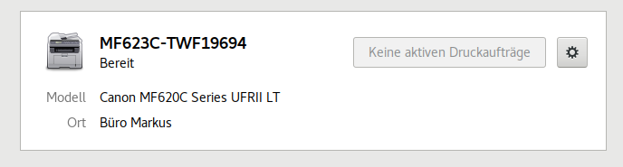

.. -*- coding: utf-8; mode: rst -*-
.. include:: ../print_scan_refs.txt

.. _printer_setup:

======================
Netzwerk-Drucker Setup
======================

In den GNOME :guilabel:`Einstellungen` unter :guilabel:`Geräte/Drucker` kann man
den Drucker einrichten.  IPP fähige Drucker werden automatisch im Netz gefunden
und i.d.R: wählt GNOME (resp CUPS) eine **driverless** PPA (siehe Kapitel
":ref:`driverless-printing`").

.. _figure-GNOME-Setup-printer:

.. figure:: GNOME-Setup-printer.png
   :alt:    Figure (GNOME-Setup-printer.png)

   GNOME Einstellungen :guilabel:`Geräte/Drucker`

Man kann mal einen Druck über diesen *automatisch* eingerichteten Drucker
probieren, wenn man mit dem Ergebnis zufrieden ist, dann braucht man auch nichts
weiter zu machen.  Hier im Beispiel mit einem Canon (MF623Cn_) klappt das aber
leider nicht, deutlich zu erkennen an der Meldung :guilabel:`Es werden keine
Aufträge angenommen`.  Die Ursachen dafür können mehrschichtig sein, Canon ist
das beste (negativ) Beispiel, z.T. wurde das ja auch schon erläutert (:ref:`REF
<cupstestppd>`, :ref:`REF <driverless-vs-canon>`).  Es macht also unter
Umständen unumgänglich den Drucker manuell hinzuzufügen.

Drucker manuell hinzufügen
==========================

Über den Button :guilabel:`Zusätzliche Druckereinstellungen` gelangt man in den
unten zu sehenden Dialog, das CUPS-Setup über die GNOME GUI
(:ref:`system-config-printer <figure-cups-system-config-printer-gui>`).

.. _figure-cups-system-config-printer:

.. figure:: system-config-printer.png
   :alt:    Figure (system-config-printer.png)

   ``system-config-printer``: CUPS Drucker-Setup auf dem ``localhost``

Alternativ kann das CUPS-Setup auch im WEB Browser unter
http://localhost:631/printers über HTML Formulare vorgenommen werden.  Auch wenn
es immer eine HTML-GUI gibt (z.B. auf Servern die keinen Desktop haben), am
komfortabelsten ist es immer noch die GNOME GUI auf dem Desktop zu nutzen.

Wie bereits erwähnt, läuft der CUPS Dienst nicht im Kontext des Benutzers
sondern als eigenständiger Dienst auf dem Server.  Damit nicht einfach jeder
beliebige Benutzer da was *verstellen* kann, gibt es Berechtigungen.  Die GNOME
GUI's nutzen zum Teil das PolicyKit `cups-pk-helper`_ aus dem gleichnamigen
APT-Paket, allerdings stehen darüber auch nicht immer alle Berechtigungen zur
Verfügung.  Nur Benutzer die zur Gruppe ``lpadmin`` (Drucker-Admins) gehören,
können auch alle Einstellungen vornehmen::

   $ members lpadmin
   cups-pk-helper <benutzername> <benutzername> ...

Weshalb man sich am besten noch zu der Gruppe Drucker-Admins (``lpadmin``)
hinzufügt::

  $ sudo gpasswd -a <benutzername> lpadmin

Über :menuselection:`Hinzufügen --> Netzwerkdrucker` den Drucker suchen lassen
und dann als Verbindung ``ipp/print`` auswählen (sicherstellen, dass oben die
Geräteadresse mit ``ipp://`` beginnt).

.. figure:: system-config-printer-NEW.png

   CUPS: Drucker-Verbindung über IPP

.. note::

   Der Vollständigkeit wegen noch Verweise zu den anderen ggf. zur Verfügung
   stehenden Protokolle: `DNS-SD aka AirPrint aka Bonjour
   <https://wiki.debian.org/PrintingGlossaryandIndex#dnssd>`_ und
   `AppSocket Protocol (aka JetDirect) <https://www.cups.org/doc/network.html#SOCKET>`_

Nun muss man einen eindeutigen Druckernamen vergeben, diesen wird man später
nicht mehr ändern können.  Ich verwende hierfür die genaue Typ-Bezeichnung plus
die Seriennummer.  Als Beschreibung wähle ich *"Farb-Laser A4 einseitig"* und
bei Ort gebe ich das Büro an / z.B.:

=================   ==========================
Druckername (ID)    ``MF623C-TWF19694``
Beschrebung         *Farb-Laser A4 einseitig*
Ort                 *Büro Markus*
=================   ==========================

Danach kann man auf :guilabel:`Vorwärts` drücken, dann kommt ein Dialog
:guilabel:`Treiber wird gesucht`, das kann einen Moment dauern.  Danach wird man
gefragt, ob man eine Test-Seite drucken möchte.  Das kann man ausprobieren, wenn
das Druck-Erzeugnis gut genug ist, ist man mit dem Einrichten des *driverless*
Treiber eigentlich schon fertig.  Aber bereits oben wurde erwähnt, dass wir
diese manuelle Installation vornehmen um weitere Anpassungen vorzunehmen.

Bei den Canon Druckern der MF620 Serie musste die PPD Datei für den *driverless*
angepasst werden.  Ein anständiges Druckbild ergab sich am Ende mit folgender
PPD Datei (s.a. Kapitel ":ref:`driverless-printing`"):

- ``CNMF620C-Series.ppd``: :origin:`CNMF620C Series, driverless (PPD modified)
  <docs/print_scan/CNMF620C-Series.ppd>`

Drucker Treiber ändern
======================

In CUPS wird das Setup eines Druckers in einer :ref:`PPD Datei <ppd_spec>`
hinterlegt, in dieser Datei steht dann auch drin, welcher Druckertreiber
verwendet wird.  Im Fall des *driverless* Treiber steht da `drvless.ppd
<https://github.com/OpenPrinting/cups-filters/blob/bcf4377b/cupsfilters/ppdgenerator.c#L1274>`_::

  *PCFileName: "drvless.ppd"

Hat man den **proprietären** Treiber :ref:`canon_urf` im System installiert, so
kann man den jetzt auch für diesen Drucker nutzen.  Der Druckertreiber für die
MF620C Serie ist::

  *PCFileName: "CNM620CZK.PPD"

Theoretisch könnte man den Treiber einfach in die bestehende PPD-Datei zum
Drucker Setup eintragen (den CUPS Dienst neu starten) und dann würde der aktiv
sein.  Jedoch haben die proprietären Treiber meist eigene Optionen und
Einstellungen zu den CUPS-Filtern, die man auch übernehmen muss.  Man muss die
PPD Datei vom Hersteller installieren.  Um also Treiber und PPD richtig
einzurichten wählt man im Kontextmenü (rechte Maustaste) des Druckers die
:menuselection:`Eigenschaften` aus.  Unter :guilabel:`Marke und Model` ist hier
im Beispiel zu sehen::

   CNMF620C Series, driverless, cups-filters 1.20.2
.. _figure-cups-system-config-printer-props:

.. figure:: system-config-printer-props.png
   :alt:    Figure (system-config-printer-props.png)

   ``system-config-printer``: Drucker-Eigenschaften

Über den :guilabel:`Ändern` Button erscheint dann der :guilabel:`Treiber ändern`
Dialog, da mal eben kurz warten, dann wird eine Auswahl angeboten.

.. _figure-cups-system-config-driver-model:

.. figure:: system-config-driver-model.png
   :alt:    Figure (system-config-driver-model.png)

   Treiber ändern (1): Drucker-Hersteller aus Datenbank auswählen

Dann den **proprietären** Treiber :ref:`canon_urf` auswählen.

.. _figure-cups-system-config-driver-type:

.. figure:: system-config-driver-type.png
   :alt:    Figure (system-config-driver-type.png)

   Treiber ändern (2): Drucker-Modell aus Datenbank auswählen

Da man den **proprietären** Treiber einrichtet, sollte man auch dessen PPD-Datei
(erst mal) unverändert übernehmen.

.. _figure-cups-system-config-ppd-settings:

.. figure:: system-config-ppd-settings.png
   :alt:    Figure (system-config-ppd-settings.png)

   Treiber ändern (3): PPD Datei des Herstellers übernehmen

.. hint::

   Bei den Canon Installationen klappt das evtl. nicht immer mit der übernahme
   der PPD-Datei des Herstellers, das ist daran zu erkennen, dass nach obigen
   Vorgehen bei :guilabel:`Marke und Modell` immer noch :menuselection:`CNMF620C
   Series, driverless, cups-filters 1.20.2` (also **driverless**) steht.

In solchen Fällen hat man noch die Möglichkeit, die PPD direkt zuzuweisen.  Das
geht auch schon über das :ref:`figure-GNOME-Setup-printer`, dort klickt man auf
das :guilabel:`Zahnrad / Drucker-Details` und dann erscheint der Dialog
(:ref:`figure-cups-system-config-install-PPD`).  In dem Dialog kann man auch
überprüfen welcher Treiber verwendet wird.

.. _figure-cups-system-config-install-PPD:

.. figure:: system-config-install-PPD.png
   :alt:    Figure (system-config-install-PPD.png)

   Setup: Details Drucker

Hier im Beispiel ist der **proprietäre** Treiber :guilabel:`Canon MF620C Series
UFRII LT` gesetzt, jetzt muss aber noch die richtige PPD zum Treiber über den
Button :guilabel:`PPD-Datei installieren ...` ausgewählt werden.  Bei der
Installation des **proprietären** Treiber :ref:`canon_urf` wurde die PPD Datei
für die *MF620C-Series* unter dem Pfad::

  /usr/share/cups/model/CNCUPSMF620CZK.ppd

installiert.  In dem Ordner liegen auch noch ein Haufen anderer PPD Dateien, die
alle aus dem Canon Paket ``cndrvcups-ufr2-uk_{3.70}-1_amd64.deb`` stammen.
I.d.R. bieten die Hersteller (wenn überhaupt) nur ein Paket mit Treibern zu
allen ihren Modellen an.  Die Dateinamen setzen sich zusammen aus::

  CNCUPSMF620CZK.ppd
  -|    -----|
   |         +--> MF620C: Modell
   +--> CN: Canon

Wenn man die richtige PPD Datei ausgewählt hat, dann kann man das schon in den
GNOME Einstellungen erkennen, dort steht bei :guilabel:`Modell` Canon MF620C
UFRII LT.

.. _figure-GNOME-Setup-URFII:

   GNOME Einstellungen: Modell Canon MF620C UFRII LT

Damit ist das Setup dann abgeschlossen und es kann gedruckt werden.  Wie schon
beim *driverless* Treiber, so empfiehlt es sich auch bei *proprietären* Treibern
die PPD mal anzuschauen.  Hier meine angepasste Version für die Canon MF620C
Serie:

- ``MF623C-TWF19694.ppd``: :origin:`Canon MF620C Series UFRII LT
  <docs/print_scan/MF623C-TWF19694.ppd>`

Falls sich noch Fragen ergeben kann man auch nochmal den Artikel im Debian Wiki
lesen: `Canon UFR-II`_.

