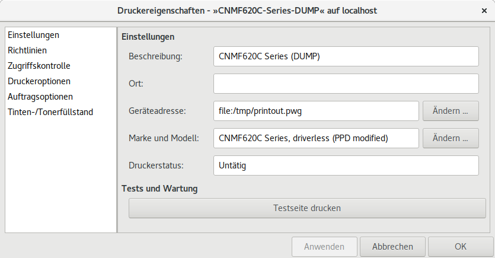

.. -*- coding: utf-8; mode: rst -*-
.. include:: ../print_scan_refs.txt

.. _print_troubleshooting:

==================
Wartung & Diagnose
==================

.. _cups-troubleshooter:

Fehlersuche über F1
===================

Eine einfache und erste, schnelle Hilfe kann der *Troubleshooting Wizard* sein.
Den bekommt man über die ``F1`` Taste im :ref:`system-config-printer
<figure-cups-system-config-troubleshooting>`.

.. _figure-cups-system-config-troubleshooting:

.. figure:: system-config-troubleshooting.png
   :alt:     Figure (system-config-troubleshooting.png)

   ``system-config-printer``: Fehlersuche :guilabel:`F1`

Das Tool zur Fehlersuche überprüft erst mal die Einstellungen und falls es dabei
Anhaltspunkte für Probleme findet, macht dazu ein entsprechende Vorschläge.
Wenn die nicht helfen kann ein Test-Druck angestoßen werden.  Hat man nur Probleme
mit einem bestimmten Dokument, dann kann man das jetzt ganz normal drucken und
den Job im Dialog mit einem Häkchen markieren.

.. _figure-cups-troubleshooter-test-page:

.. figure:: cups-troubleshooter-test-page.png
   :alt:     Figure (cups-troubleshooter-test-page.png)

   Troubleshooter: Testdruck eines *problematischen* Dokuments

Wenn alle Tests abgeschlossen sind, besteht am Ende die Möglichkeit die Diagnose
Daten (:origin:`troubleshoot.txt <docs/print/troubleshoot.txt>`) zu speichern.
Deren Studium kann z.T. nützliche Informationen hervorbringen.

.. _figure-cups-troubleshooter-diagnostic:

.. figure:: cups-troubleshooter-diagnostic.png
   :alt:     Figure (cups-troubleshooter-diagnostic.png)

   Troubleshooter: Speichern der Diagnose Daten :origin:`troubleshoot.txt <docs/print/troubleshoot.txt>`

Es kann auch mal helfen die Diagnose Daten verschiedener Druckaufträge
miteinander zu vergleichen.  Als ein Beispiel sei Commit :commit:`56b89eb`
gegeben. Bei dem Commit sieht man den Unterschied zwischen einem Druck über den
``MF623C-TWF19694`` Drucker und über den mit ``CNMF620C-Series`` eingerichteten
Drucker.

.. _cups-debug-cups-service:

CUPS Server debug
=================

Der CUPS Dienst kann mit folgenden Kommandos gestartet resp. eingesehen
werden.::

   sudo -H systemctl restart cups
   sudo -H journalctl --no-pager -u cups

Das Debug-LOG zum CUPS Dienst kann über die Kommandozeile aktiviert/de-aktiviert
werden::

  $ cupsctl -U <benutzer> --[no-]debug-logging

oder über die HTML GUI des CUPS: http://localhost:631/admin/ kann mit der Option
:guilabel:`Mehr Informationen zur Fehlersuche speichern` das Debug-LOG
eingeschaltet werden.

.. _figure-cupsd-debug-on:

.. figure:: cupsd-debug-on.png
   :alt:    Figure (cupsd-debug-on.png)
   :target: http://localhost:631/admin/
   :scale:  70%

   ``localhost:631``: CUPS Server Einstellungen

Die Einstellung wird aktiv, sobald :guilabel:`Einstellung ändern` bestätigt
wird.  Hier das LOG zu dem Print-Job 140 aus der obige
:ref:`cups-troubleshooter`.

- :origin:`cups_debug_log_test_job140.txt`

Dort kann man z.B. sehen, was die CUPS-Filter machen um die Umwandlung des PDFs
in die PDL des Druckers hin zu bekommen.::

  D [20/Feb/2019:15:38:20 +0100] [Job 140] Ghostscript command line: \
       gs -dQUIET -dPARANOIDSAFER -dNOPAUSE \
      -dBATCH -dNOINTERPOLATE -dNOMEDIAATTRS -dShowAcroForm -sstdout=%stderr -sOutputFile=%stdout \
      -sDEVICE=cups -sMediaClass=PwgRaster -sMediaType=Auto -r600x600 -dDEVICEWIDTHPOINTS=595 -dDEVICEHEIGHTPOINTS=841 \
      -dcupsBitsPerColor=8 -dcupsColorOrder=0 -dcupsColorSpace=1 -dcupsBorderlessScalingFactor=0.0000 \
      -dcupsInteger1=1 -dcupsInteger2=1 -scupsPageSizeName=iso_a4_210x297mm -I/usr/share/cups/fonts -c -f -_
  ...
  D [20/Feb/2019:15:38:20 +0100] [Job 140] PID 25582 (/usr/lib/cups/filter/gstoraster) exited with no errors.

Hier zu sehen; es wird der ``gstoraster`` Filter verwendet (s.a. Absatz
":ref:`cupsfilter-command`").

.. _cups-debug-browse-service:

CUPS Browser (debug)
====================

Der CUPS Browser Dienst sucht permanent nach (neu) verfügbaren Druckern und
Druck-Diensten (andere CUPS-Server) und stellt diese dem Client zur Verfügung.
Der CUPS Browser Dienst kann mit folgenden Kommandos gestartet resp. eingesehen
werden.::

   sudo -H systemctl restart cups-browsed
   sudo -H journalctl --no-pager -u cups-browsed

Wird der IPP-fähige Drucker (oder der *zentrale CUPS Server*) im Netzwerk nicht
automatisch erkannt, so kann es bei der Fehlersuche hilfreich sein, das
Debug-LOG des Dienstes ``cups-browsed`` zu analysieren.  Das Debug-LOG kann in
der Config-Datei zum Dienst eingestellt werden::

  /etc/cups/cups-browsed.conf

Mit der folgenden Einstellung::

   # Where should cups-browsed create its debug log file (if "DebugLogging file"
   # is set)?

   LogDir /var/log/cups

   # How should debug logging be done? Into the file
   # /var/log/cups/cups-browsed_log ('file'), to stderr ('stderr'), or
   # not at all ('none')?

   DebugLogging file
   # DebugLogging stderr
   # DebugLogging file stderr
   # DebugLogging none

wird ein Debug-LOG in der Datei ``/var/log/cups/cups-browsed_log`` angelegt,
sobald der Dienst neu gestartet wurde::

  $ sudo -H systemctl restart cups-browsed

.. _debug_dump_to_file:

Druckausgabe in Datei
=====================

Um die Ausgabe auf den Drucker in eine Datei umzuleiten muss in der Datei
``/etc/cups/cups-files.conf`` die Option *FileDevice Yes* gesetzt werden::

  # Do we allow file: device URIs other than to /dev/null?
  #FileDevice No
  FileDevice Yes

Danach den CUPS Dienst neu starten::

  sudo -H systemctl restart cups

In der :ref:`GUI <figure-cups-system-config-printer-gui>` sollte der bestehende
Drucker kopiert werden.  Hier im Beispiel wird der ``CNM620C-Series-DUMP`` durch
eine Kopie des :ref:`CNM620C-Series <driverless-printing>` erzeugt.  In den
Einstellungen des ``CNM620C-Series-DUMP`` wird die *Geräteadresse* auf
``file:/tmp/printout.pwg`` gesetzt.

.. _tmp-printout-device:

   Druckausgabe in Datei umlenken

Ein Ausdruck auf den Drucker ``CNM620C-Series-Dump`` legt die Datei
``/tmp/printout.pwg`` an.

Wäre der Drucker PostScript-fähig, so würde man eine PS Datei erhalten.  Hier im
Beispiel handelt es sich aber um einen Drucker der kein PS unterstützt, die
Druckausgabe ist dann typischer Weise ``image/pwg-raster`` (deshalb auch die
Dateiendung ``printout.pwg``).  Mit dem RasterView_ kann dieses Format auch auf
dem Desktop angezeigt werden.

Kommandos
=========

- `CUPS Command-Line Printing and Options <https://www.cups.org/doc/options.html>`_
- :man:`lp`
- :man:`lpadmin`

Kommando :man:`lpinfo` listet die dem CUPS-Server bekannten verfügbaren Geräte oder
Treiber auf::

  $  lpinfo -v
  network beh
  file cups-brf:/
  network ipps
  network socket
  network https
  network ipp
  network http
  network lpd
  network dnssd://Canon%20MF620C%20Series._ipp._tcp.local/?uuid=6d4ff0ce-6b11-11d8-8020-f48139e3ba8e
  network socket://192.168.1.119
  network ipp://MF623Cn.local:80/ipp/print

Kommando :man:`pdfinfo` für die 7. bis 8. Seite des PDF::

  $ pdfinfo -f 7 -l 8 Test-Dateien/QR-Code-Test.pdf
  Tagged:         no
  UserProperties: no
  Suspects:       no
  Form:           none
  JavaScript:     no
  Pages:          8
  Encrypted:      no
  Page    7 size: 595.28 x 841.89 pts (A4)
  Page    7 rot:  0
  Page    8 size: 595.28 x 841.89 pts (A4)
  Page    8 rot:  0
  File size:      835779 bytes
  Optimized:      no
  PDF version:    1.4

Kommando :man:`lpstat`::

  $ lpstat -p
  Drucker CNMF620C-Series ist im Leerlauf.  Aktiviert seit Do 21 Feb 2019 18:08:52 CET
  Drucker CNMF620C-Series-DUMP ist im Leerlauf.  Aktiviert seit So 24 Feb 2019 16:47:51 CET
  Drucker MF623C-TWF19694 ist im Leerlauf.  Aktiviert seit Di 19 Feb 2019 19:42:58 CET

.. _cupsfilter-command:

Kommando ``cupsfilter``
=======================

Mit dem Kommando :man:`cupsfilter` (aus dem Pakte :deb:`cups`) und der Option
``--list-filters`` können die verwendeten Filter angezeigt werden::

  $ sudo -H cupsfilter --list-filters \
      -m image/pwg-raster \
      -p CNMF620C-Series.ppd \
      Test-Dateien/PDF-test.pdf
  pdftopdf
  gstoraster

Mit der Option ``-m image/pwg-raster`` wird als *Zieldatei-Typ* das PWG-Raster
Format gewählt, das auch von dem Drucker (MF620) unterstützt wird.  Der
Quelldatei-Typ kann optional über ``-i MIME/Typ`` angegeben oder automatisch
erkannt werden.

.. admonition::  Achtung BUG

   Laut :man:`man-cupsfilter <cupsfilter>` soll es möglich sein, mit der Option
   ``-m printer/<druckername>`` zu dem Druckerformat zu konvertieren, wie es von
   den Filtern in der PPD-Datei definiert ist.  Das scheint aber nicht zu
   funktionieren (vergleiche mit ``gstoratser`` obiger Ausgabe).  Schaut man in
   das LOG für einen solchen Auftrag, dann ermittelt :man:`cupsfilter` immer als
   Zieldatei-Typ ``application/vnd.cups-postscript`` (keine Ahnung, warum)::

     $ sudo -H cupsfilter --list-filters \
         -m printer/CNMF620C-Series \
	 -p /etc/cups/ppd/CNMF620C-Series.ppd \
	 Test-Dateien/PDF-test.pdf
     pdftopdf
     pdftops
     ...
     DEBUG: envp[15]="FINAL_CONTENT_TYPE=application/vnd.cups-postscript"

Lässt man die Option ``--list-filters`` weg, so bekommt man auf ``stdout`` die
Daten, de an den Drucker gesendet werden, auf ``stderr`` bekommt man ein
ausführliches LOG dazu::

  $ sudo -H cupsfilter \
      -m image/pwg-raster \
      -p CNMF620C-Series.ppd \
      Test-Dateien/PDF-test.pdf  > Test-Dateien/PDF-test.pwg

  DEBUG: argv[0]="cupsfilter"
  DEBUG: argv[1]="1"
  DEBUG: argv[2]="root"
  DEBUG: argv[3]="PDF-test.pdf"
  DEBUG: argv[4]="1"
  DEBUG: argv[5]=""
  DEBUG: argv[6]="Test-Dateien/PDF-test.pdf"
  DEBUG: envp[0]="<CFProcessPath>"
  DEBUG: envp[1]="CONTENT_TYPE=application/pdf"
  DEBUG: envp[2]="CUPS_DATADIR=/usr/share/cups"
  DEBUG: envp[3]="CUPS_FONTPATH=/usr/share/cups/fonts"
  DEBUG: envp[4]="CUPS_SERVERBIN=/usr/lib/cups"
  DEBUG: envp[5]="CUPS_SERVERROOT=/etc/cups"
  DEBUG: envp[6]="LANG=de_DE.UTF8"
  DEBUG: envp[7]="PATH=/usr/lib/cups/filter:/usr/bin:/usr/sbin:/bin:/usr/bin"
  DEBUG: envp[8]="PPD=/etc/cups/ppd/CNMF620C-Series.ppd"
  DEBUG: envp[9]="PRINTER_INFO=cupsfilter"
  DEBUG: envp[10]="PRINTER_LOCATION=Unknown"
  DEBUG: envp[11]="PRINTER=cupsfilter"
  DEBUG: envp[12]="RIP_MAX_CACHE=128m"
  DEBUG: envp[13]="USER=root"
  DEBUG: envp[14]="CHARSET=utf-8"
  DEBUG: envp[15]="FINAL_CONTENT_TYPE=image/pwg-raster"

  INFO: pdftopdf (PID 26759) started.
  INFO: gstoraster (PID 26760) started.

  DEBUG: OUTFORMAT="(null)", so output format will be CUPS/PWG Raster
  DEBUG: pdftopdf: Last filter determined by the PPD: -; FINAL_CONTENT_TYPE:\
    image/pwg-raster => pdftopdf will log pages in page_log.
  PAGE: 1 1
  DEBUG: Color Manager: Calibration Mode/Off
  INFO: pdftopdf (PID 26759) exited with no errors.
  DEBUG: Calling FindDeviceById(cups-cupsfilter)
  DEBUG: Failed to send: org.freedesktop.ColorManager.NotFound:device id 'cups-cupsfilter' does not exist
  DEBUG: Failed to get find device cups-cupsfilter
  DEBUG: Calling FindDeviceById(cups-cupsfilter)
  DEBUG: Failed to send: org.freedesktop.ColorManager.NotFound:device id 'cups-cupsfilter' does not exist
  DEBUG: Failed to get device cups-cupsfilter
  INFO: Color Manager: no profiles specified in PPD
  DEBUG: Color Manager: ICC Profile: None

  DEBUG: Ghostscript using Center-of-Pixel method to fill paths.
  DEBUG: Ghostscript command line: \
    gs -dQUIET -dPARANOIDSAFER -dNOPAUSE -dBATCH -dNOINTERPOLATE -dNOMEDIAATTRS \
  	-dShowAcroForm -sstdout=%stderr -sOutputFile=%stdout -sDEVICE=cups \
  	-sMediaClass=PwgRaster -sMediaType=Auto -r600x600 \
  	-dDEVICEWIDTHPOINTS=595 -dDEVICEHEIGHTPOINTS=842 -dcupsBitsPerColor=8 -dcupsColorOrder=0 \
  	-dcupsColorSpace=19 -dcupsBorderlessScalingFactor=0.0000 -dcupsInteger1=1 -dcupsInteger2=1\
  	-scupsPageSizeName=A4.Fullbleed -I/usr/share/cups/fonts -c '0 .setfilladjust' -f -_

  DEBUG: envp[0]="<CFProcessPath>"
  DEBUG: envp[1]="CONTENT_TYPE=application/pdf"
  DEBUG: envp[2]="CUPS_DATADIR=/usr/share/cups"
  DEBUG: envp[3]="CUPS_FONTPATH=/usr/share/cups/fonts"
  DEBUG: envp[4]="CUPS_SERVERBIN=/usr/lib/cups"
  DEBUG: envp[5]="CUPS_SERVERROOT=/etc/cups"
  DEBUG: envp[6]="LANG=de_DE.UTF8"
  DEBUG: envp[7]="PATH=/usr/lib/cups/filter:/usr/bin:/usr/sbin:/bin:/usr/bin"
  DEBUG: envp[8]="PPD=/etc/cups/ppd/CNMF620C-Series.ppd"
  DEBUG: envp[9]="PRINTER_INFO=cupsfilter"
  DEBUG: envp[10]="PRINTER_LOCATION=Unknown"
  DEBUG: envp[11]="PRINTER=cupsfilter"
  DEBUG: envp[12]="RIP_MAX_CACHE=128m"
  DEBUG: envp[13]="USER=root"
  DEBUG: envp[14]="CHARSET=utf-8"
  DEBUG: envp[15]="FINAL_CONTENT_TYPE=image/pwg-raster"
  INFO: Start rendering...
  INFO: Processing page 1...
  INFO: Processing page 2...
  INFO: Rendering completed
  INFO: gstoraster (PID 26760) exited with no errors.

In dem LOG ist zu erkennen mit welchen Optionen Ghostscript_ vom gstoraster.c_
Filter aufgerufen wird.  Schaut man mit dem Rasterview_ in die erzeugte
PWG-Datei, dann sieht man dort auch die PWG Attribute (vergleiche `PWG-Spec
<https://ftp.pwg.org/pub/pwg/candidates/cs-ippraster10-20120420-5102.4.pdf>`_)::

  PWG Raster Page Attributes:

  MediaColor = ""
  MediaType = "Auto"
  PrintContentOptimize = ""
  CutMedia = 0
  Duplex = 0
  HWResolution = [ 600 600 ]
  InsertSheet = 0
  Jog = 0
  LeadingEdge = 0
  MediaPosition = 0
  MediaWeightMetric = 0
  NumCopies = 1
  Orientation = 0
  PageSize = [ 595 842 ]
  Tumble = 0
  Width = 4958
  Height = 7017
  BitsPerColor = 16
  BitsPerPixel = 48
  BytesPerLine = 29748
  ColorOrder = CUPS_ORDER_CHUNKED
  ColorSpace = CUPS_CSPACE_SRGB
  NumColors = 3
  TotalPageCount = 0
  CrossFeedTransform = 1
  FeedTransform = 1
  ImageBoxLeft = 0
  ImageBoxTop = 0
  ImageBoxRight = 0
  ImageBoxBottom = 0
  AlternatePrimary = ffffff (255, 255, 255)
  PrintQuality = 0
  VendorIdentifier = 0
  VendorLength = 0
  VendorData =
  RenderingIntent = ""
  PageSizeName = "A4.Fullbleed"

Verweise
========

Hier ein paar Verweise auf WEB Seiten, die bei der Fehlersuche ggf. auch
hilfreich sein können:

- `Dissecting and Debugging the CUPS Printing System`_
- `Debugging Printer Problems (ubuntu-wiki)`_
- `How to debug printing problems (fedora wiki)`_
- `Drucker (archlinux wiki)`_ & `CUPS (archlinux)`_ & `CUPS Troubleshooting (archlinux wiki)`_

