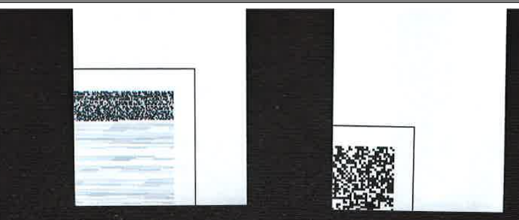
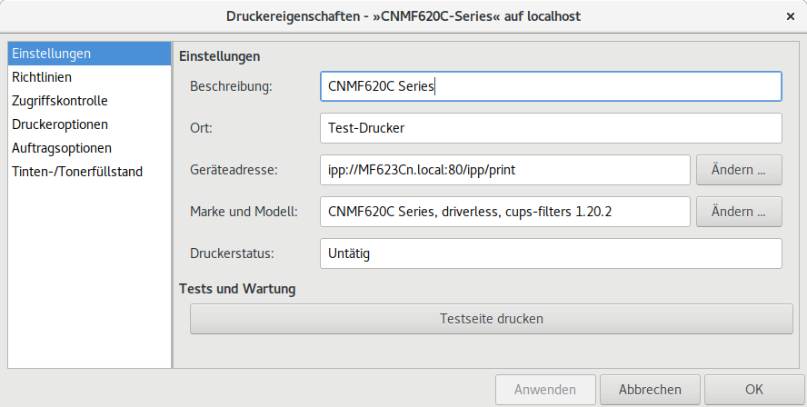
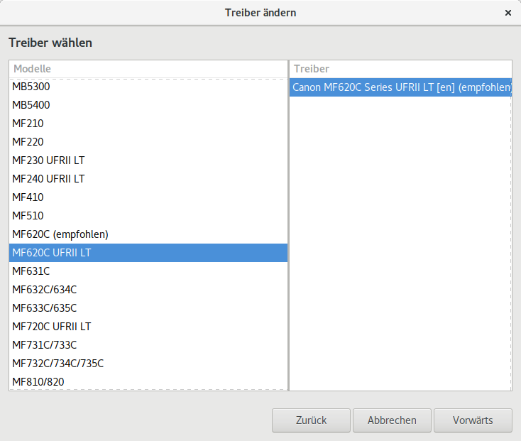
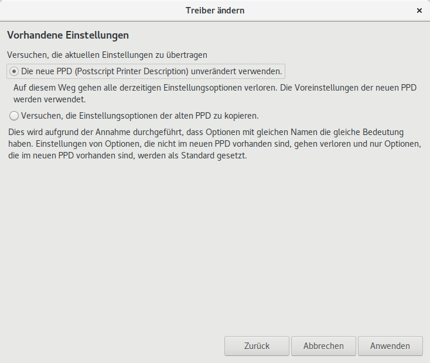
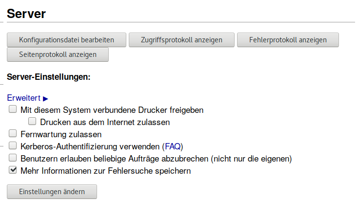

.. -*- coding: utf-8; mode: rst -*-

.. include:: ../print_scan_refs.txt

.. _cups_canon:

==========================
CUPS, IPP & Canon (UFR-II)
==========================

  Wir beschäftigen uns hier mit CUPS und Netzwer-Druckern, also solche, die über
  WLAN oder LAN im Netzwerk zur Verfügung stehen (Scan siehe :ref:`scan_linux`).
  Es geht um generische Druckertreiber, IPP & driverless-printing_ am Beispiel
  eines Canon Druckers.  Das Canon Beispiel dient (leider immer noch) als gutes
  Beispiel, um aufzuzeigen wann evtl. ein proprietärer Treiber
  (:ref:`canon_urf`) erforderlich werden kann und wie man den installiert ohne
  sich den ganzen Rotz von Canon im System einzuverleiben.

Die Drucker-Verwaltung unter Linux ist das Common Unix Printer System `CUPS
(wiki)`_ [`git <https://github.com/apple/cups>`_], welche i.d.R. in jedem Linux
Desktop-System bereits vorinstalliert ist.  Auf Server System ist CUPS ggf. noch
nicht installiert, kann aber recht einfach installiert werden::

   sudo apt-get install cups cups-client cups-bsd

CUPS unterstützt 2D (Papier) und ab V2.1 auch 3D Druck (s.a `IPP 3D`_).  Wie das
**S**\ *ystem* in CUP\ **S** bereits andeutet handelt es nicht um einen
*schlichten* Drucker Treiber sondern um ein *Druck-System*, das Dienste rund um
das Thema "Drucken" im Netzwerk bereit stellt.  Die Idee ist, dass man alle
Drucker und Druck-Funktionen in einem Dienst vereint (der Server) und die
Clients (Desktop Systeme, mobile Geräte etc.) über diesen Dienst ihre
Druck-Anforderungen abwickeln, ohne das man auf jedem dieser Geräte einen
Druckertreiber oder eine spezielle Druckfunktion installieren muss.

Im Backend des CUPS, werden die Druckertreiber registriert, da bietet CUPS
z.T. generische Treiber an, die i.d.R. schon sehr gut funktionieren.  Alle
halbwegs modernen Netzwerk-Drucker unterstützen das *Internet Printing Protocol*
(IPP_), welches auch CUPS implementiert.  Das IPP ist ein -- wie der Name schon
sagt -- ein Internet-Protokoll.  *Genauer*: es ist eine Erweiterung des
bekannten HTTP 1.1 Protokolls wie man es für *Internetseiten* kennt und läuft
i.d.R. auf den gleichen Ports `80` (HTTP) und `443` (HTTPS).

Vor dem Backend, also *auf dem Weg hin zu den Druckern* gibt es sogenannte
CUPS-Filter, welche die Druck-Daten der Clients so aufbereiten, dass der Drucker
an den sie gerichtet werden diese verstehen kann.  Hier in diesem Artikel wird
beispielsweise ein Canon Drucker eingerichtet, der bietet zwar das IPP_,
*spricht* aber weder `Postscript (wiki)`_ noch PDF_.  Als Druckersprache kennt
der nur UFR-II:

.. _figure-MF623Cn-printer-spec:

.. figure:: MF623Cn-printer-spec.png
   :alt:     Figure (MF623Cn-printer-spec.png)
   :target:  https://www.canon.de/for_home/product_finder/multifunctionals/laser/i-sensys_mf623cn/specification.aspx

   MF623Cn_: technische Angaben

IPP & IPP Everywhere
====================

Was in der Spezifikation (siehe :ref:`figure-MF623Cn-printer-spec`) nicht
angegeben ist: der Drucker beherrscht auch IPP_ und IPP fähige Drucker als
Drucksprache mindestens JPEG verstehen müssen (s.a.  `What is IPP
<https://github.com/apple/cups/wiki/IPP-(Everywhere)-Mini-Tutorial>`_).

.. code-block:: none

   1. There are no longer any "proprietary" printer languages exclusive for a
      printer. IPP-enabled printers MUST support PWG Raster and JPEG as print
      job spooling formats and MUST support PDF as a print job spooling format
      when the printer uses IPP/2.1 and IPP/2.2. (PDF support is optional for a
      printer using IPP/2.0).

   2. IPP-enabled printers are able to respond to queries investigating about
      their capabilities. (Can they print duplex? Can they print in color? Do
      they support stapling? Have they paper with A3 dimensions loaded? How much
      ink do they have left? etc.pp.)

Damit hat man also die Möglichkeit die Eigenschaften des Druckers über IPP_ zu
ermitteln.  Das wollen wir gleich mal machen, aber vorher wollen wir uns nochmal
`IPP Everywhere`_ anschauen, damit können Drucker im Netzwerk *gefunden* werden.

Drucker die über IP im Netzwerk bereit stehen, können über Avahi_ gefunden
werden.  `Avahi (git)`_ ist eine freie Implementierung von Zeroconf_, das
Pendant auf macOS ist Bonjour_ von Apple.  Aufgabe dieser Zeroconf Werkzeuge ist
es, Dienste welche im IP-Netz bereit stehen zu finden.  Das praktische an Avahi:
es ist eh schon auf allen Linux Desktops eingerichtet.  Das einzige was man
evtl. noch festhalten kann ist, dass sowohl CUPS als auch IPP sich des Avahi
bedienen um Drucker im Netzwerk automatisch zu finden:

  .. hint::

     IPP ``2.x`` wurde im Jahre 2015 verabschiedet und `IPP Everywhere`_
     resp. driverless-printing_ gibt es in Ubuntu seit 17.04.

Wenn der Drucker über WLAN oder LAN angeschlossen ist und eine IP erhalten hat
(https://mf623cn/portal_top.html), dann müssten wir ihn eigentlich über IPP
finden können.  Die Implementierung dazu ist das Kommando :man:`ippfind`::

  $ ippfind
  ipp://MF623Cn.local:80/ipp/print

Cool, einfacher geht es ja wirklich nicht mehr!  Nun wollen wir mal schauen
welche Eigenschaften der Drucker über das ``ipp://`` Protokoll anbietet
resp. anzeigt.  Dazu gibt es das Kommando :man:`ipptool`::

  $ ipptool -t -v \
        ipp://MF623Cn.local:80 \
	| /usr/share/cups/ipptool/get-printer-attributes.test \
	| grep 'document-format-supported\|ipp-versions-supported'

Die Ausgabe für den All-in-One Drucker MF623Cn_ :

.. code-block:: none

    ipp-versions-supported (1setOf keyword) = 2.0,1.1,1.0
    document-format-supported (1setOf mimeMediaType) = image/urf,application/octet-stream,image/jpeg,image/pwg-raster

Der hat also IPP V-2.0 und dazu hieß es ja schon oben im Zitat: *PDF support is
optional for a printer using IPP/2.0*.  Das deckt sich also mit den Annahmen zu
dem Drucker.  Auch die Formate ``image/jpeg`` und ``image/pwg-raster``, wie sie
von IPP 2.0 erwartet werden, bietet der Drucker an.  Mit ``image/urf`` bietet er
noch das Raster-Format von AirPrint_ an.  Die Definitionen zu den IPP Attributen
und Objekten sind bei IANA registriert, eine vollständige Liste gibt es hier:

- `IANA IIP Registration`_ z.B. `RFC8011 <https://tools.ietf.org/html/rfc8011>`_
  mit dem IPP V-1.1.

  - `document-format-supported <https://tools.ietf.org/html/rfc8011#section-5.4.22>`_
  - `ipp-versions-supported  <https://tools.ietf.org/html/rfc8011#section-5.4.14>`_

Da es die IPP-Versionen V-2.0, V-2.1 und V-2.2 gibt könnte der Eindruck
entstehen, dass die V-1.1 veraltet ist.  Das ist aber nicht der Fall, die
``2.x`` Versionen adressieren lediglich die Anwendungsbereiche (siehe Kapitel
*Introduce* in `IPP Version 2.0, 2.1, and 2.2`_).  Für die typischen
Büro-Drucker kommt IPP V2.0 zur Anwendung.

.. note::

   Die Verabschiedung der IPP ``2.x`` Versionen ist aus dem Jahre 2015, also
   noch recht *frisch*!  Es braucht auch immer etwas Zeit, bis so ein Standard
   dann vollständig und ohne Kinderkrankheiten in die (neuen) Geräte und
   Distributionen eingeflossen ist.

Der Drucker MF623Cn_ ist aus Mitte 2016, damit gehört (vermute ich mal) zu der
ersten Generation, die diesen Standard unterstützt.  Nachfolger wäre der
MF631Cn_, der hat aktuell allerdings auch die gleiche Firmware 3.05::

  printer-firmware-name (nameWithoutLanguage) = IPP
  printer-firmware-string-version (textWithoutLanguage) = 03.05
  printer-firmware-version (octetString) = 0305

Bei der Spezifikation des MF631Cn_ ist u.A. zu lesen: *Drucken von
USB-Speicherstick (JPEG, TIFF, PDF)*. Dass lässt mich vermuten, dass es sich --
im Gegensatz zum MF623Cn_ -- um einen PDF-fähigen Drucker handelt.

Schaut man sich mal die gesamte Ausgabe an (:origin:`MF623Cn-attributes.txt
<docs/print_scan/MF623Cn-attributes.txt>`), dann wird erkennt man schon die
ersten *Kinderkrankheiten*::

  $ ipptool -t -v ipp://MF623Cn.local:80  /usr/share/cups/ipptool/get-printer-attributes.test
  ..
  printer-resolution-default (resolution) = 300dpi
  printer-resolution-supported (resolution) = 300dpi

Der Drucker behauptet also, dass er eine Auflösung von 300dpi hat, was man wohl
eher als `You are fake news!  <https://www.youtube.com/watch?v=1IDF-8khS3w>`_
einstufen kann.  Der Drucker wird als 600dpi Drucker beworben und verfügt auch
über diese Auflösung.  Diese und diverse andere fehlerhafte IPP-Angaben zu dem
Drucker sind auch mit ein Grund dafür, dass driverless-printing_ z.T. schlechte
Druck-Ergebnisse liefert (oder evtl. gar nicht funktioniert).

.. _driverless-printing:

driverless printing
===================

Über das `driverless-printing CUPS`_ müsste in einer Standard Installation des
Ubuntu (18.04) resp. Debian Desktop Systems (mit CUPS) einem der IPP fähige
Drucker bereits im Setup unter "Geräte" angeboten werden.  Alternativ kann man
dort auch auf *"Zusätzliche Druckereinstellungen"* drücken, womit dem das
Programm ``system-config-printer`` gestartet wird.

.. _figure-cups-system-config-printer-gui:

.. figure:: system-config-printer-gui.png
   :alt:     Figure (system-config-printer-gui.png)
   :target:  https://github.com/zdohnal/system-config-printer

   ``system-config-printer``: CUPS GUI für Drucker- Konfiguration und
   Statusabfrage.

In dem Fenster kann man *"Hinzufügen"* klicken und über einen geführten Dialog
den Drucker einrichten.  Eine detallierte Anleitung findet man unter:
:ref:`printer_setup`.  Hier beim MF623Cn wurde der Drucker mit dem Treiber

- Für MF623Cn_ angepasste PPD: :origin:`CNMF620C Series, driverless
  <docs/print_scan/CNMF620C-Series.ppd>`

eingerichtet.  Zu sehen im GNOME-Setup unter *Geräte/Drucker* und über einen
Klick auf *Zahnrad / Drucker-Details*.  Den *driverless* Drucker sollte man mal
testen.  Mit einem modernen PDF-fähigen Drucker (``application/pdf``) von einem
Hersteller, der IPP beherrscht wird man vermutlich schon respektable Erzeugnisse
anfertigen können.  Beim MF623Cn gibt es allerdings noch einige
Kinderkrankheiten.  In solchen Fällen gibt es zwei Möglichkeiten.

 1. man installiert sich den **proprietären** Druckertreiber (:ref:`canon_urf`)
    des Herstellers -- sofern für Linux vorhanden -- und schaut sich die
    Druck-Ergebnisse damit an (:ref:`driverless-vs-canon`).

 2. Man steigt etwas tiefer in die Materie `CUPS (wiki)`_ (-Filter) und
    ggf. IPP_ ein und richtet sich eine eigene `PPD (wiki)`_ ein.

Mit `CUPS (wiki)`_ kann man für den physikalisch gleichen Drucker mehrere
unabhängige Drucker-Setups einrichten, so kann man beispielsweise ein
bestehendes Setup auch kopieren und dann verändern.  Diese Drucker-Setups sind
aus Sicht der Programme voneinander unabhängige Drucker.  Man braucht also sein
*funktionierendes* Setup erst mal nicht *anfassen*, wenn man mal was
ausprobieren möchte.

- `driverless-printing CUPS`_
- Thread zu IPP: https://lists.debian.org/debian-printing/2016/12/msg00160.html
- `IPP Everywhere™ Self-Certified Printers <http://www.pwg.org/dynamo/eveprinters.php>`_
- `AirPrint Drucker <https://support.apple.com/en-us/HT201311>`_
- `Writing your own CUPS printer driver in 100 lines of Python
  <https://behind.pretix.eu/2018/01/20/cups-driver/>`_

.. _canon_urf:

MF-620C Serie URF-II
====================

Die moderneren Canon Drucker unterstützen Ultra Fast Renderer (UFR) welches man
sich über einen **proprietären** Treiber auch auf dem PC installieren kann.  Die
Linux Treiber für die Drucker der MF620C Serie gibt es bei Canon:

- https://support-asia.canon-asia.com/contents/ASIA/EN/0100924010.html

Dort sind auch Installationsanleitungen gegeben, diesen sollte man **nicht**
folgen: **Die Linux Pakete von Canon sind schon immer dafür bekannt, diversen
Schrott zu installieren**.  Das gilt sowohl für die Druck- als auch für die
SCAN- Funktionen (Bitte auch :ref:`driverless-vs-canon` lesen).  Es empfiehlt
sich von daher nur die nötigsten Sachen (die binären Treiber und die PPDs) aus
dem Treiber-Download zu installieren und das ist auch ganz einfach: In den
``linux-UFRII-drv-v{xxx}-uken.tar.gz`` Archiven gibt es zwei, max. drei Pakete
die man installieren muss, mehr bitte nicht:

- ``cndrvcups-common_{4.10}-1_amd64.deb``
- ``cndrvcups-ufr2-uk_{3.70}-1_amd64.deb``
- ``cndrvcups-utility_{1.10}-1_amd64.deb`` (funktioniert i.d.R nicht)

Die ``.tar.gz`` Datei im Download-Ordner auspacken (über rechte Maustaste *"Hier
entpacken"*).  In dem dann angelegten Ordner muss man sich etwas nach unten
*durchklickern*: ``64-bit_Driver/Debian``.  Dort sieht man dann auch schon die
`Debian Pakte <https://de.wikipedia.org/wiki/Debian_Package_Manager>`_ mit der
Dateiendung ``.deb``.  Diese kann man mit eine *Doppelklick* einfach
installieren.

Leider ist die Installation damit nicht erledigt, da Canon seit jeher unfähig
ist, echte 64-bit Bibliotheken zu compilieren: in den mit ``amd64``
gekennzeichneten Paketen ist der *UFRII-Closed-Source-Treiber* in Form von
32-Bit Bibliotheken enthalten, die wiederum auf anderen 32-Bit Bibliotheken des
Betriebssystems aufbauen.  Welche aber auf dem (eigenen) 64-Bit Betriebssystem
i.d.R. nicht zu erwarten sind.

Normalerweise kann der Paket-Ersteller solche Abhängigkeiten in den ``.deb``
beschreiben und dann würde der Paket-Manager darauf reagieren können, aber auch
dazu ist Canon als Paket-Ersteller seit jeher dazu nicht in der Lage.  Mit dem
Effekt, dass der Anwender mal wieder Blutdruck bekommt, weil *Drucken nicht
funktioniert*, es aber er auch keine hilfreichen Fehlermeldungen gibt.

Diese Abhängigkeiten zu den 32-Bit Bibliotheken müssen wir manuell installieren
(i.d.R. muss man das auch, wenn man die Installation-Anweisungen von Canon
befolgen würde).  Man installiert daher zuerst die benötigten 32-Bit
Bibliotheken::

  sudo apt-get install lib32stdc++6 libxml2:i386

Bei moderneren Druckern, sollte der Drucker nun automatisch gefunden und
eingebunden werden.  Falls das bei dem eigenen Drucker noch nicht klappt, sollte
man mit dem :ref:`printer_setup` fortfahren.

- Für MF623Cn_ angepasste PPD (URFII): :origin:`Canon MF620C Series UFRII LT
  <docs/print_scan/MF623C-TWF19694.ppd>`

.. _driverless-vs-canon:

Druckbild Canon VS driverless
=============================

Hier ein Vergleich des Druckbilds des All-in-One Drucker MF623Cn_, einmal mit
dem origignal :ref:`Canon URF-II Treiber <canon_urf>` (links) und dem
:ref:`driverless-printing <printer_setup>` (rechts).

.. _figure-MFC620-Series-driverless-vs-canon:

   Druckbild MFC620 Series: :ref:`Canon URF-II Treiber <canon_urf>` (links)
   :ref:`driverless-printing <printer_setup>` (rechts)

Das :ref:`oben gezeigt Bild <figure-MFC620-Series-driverless-vs-canon>` ist der
rechte-obere Ausschnitt eines A4-Drucks, bei dem oben in der Ecke ein `QR-Code
(wiki)`_ war.  Links sieht man, dass der Original Canon Treiber zwar bis in die
Ecken druckt aber den QR-Code im PDF nur zerstört ausdruckt.  Bei genauerer
Betrachtung (nicht im Bild zu erkennen) stellt man auch fest, dass der original
Treiber nicht farbecht ist.

Der Druck über den Drucker des :ref:`driverless-printing <printer_setup>` zeigt
das Problem, dass er nicht bis in die Ecken drucken kann, dafür wird aber der
QR-Code nicht zerstört (was manchmal wichtiger sein kann).  Bei genauerer
Betrachtung (nicht im Bild zu erkennen) hat man den Eindruck, dass der Druck
Farbecht ist, jedoch scheint die Auflösung und Farbtiefe nicht ganz ausgereizt
zu werden.

Debug-LOG für den :ref:`Canon URF-II Treiber <canon_urf>` Druck (links)::

  D [11/Feb/2019:14:32:00 +0100] [Job 81] 3 filters for job:
  D [11/Feb/2019:14:32:00 +0100] [Job 81] pdftopdf (application/pdf to application/vnd.cups-pdf, cost 66)
  D [11/Feb/2019:14:32:00 +0100] [Job 81] pdftops (application/vnd.cups-pdf to application/vnd.cups-postscript, cost 100)
  D [11/Feb/2019:14:32:00 +0100] [Job 81] pstoufr2cpca (application/vnd.cups-postscript to printer/MF623C-TWF19694, cost 0)
  D [11/Feb/2019:14:32:00 +0100] [Job 81] job-sheets=none,none
  D [11/Feb/2019:14:32:00 +0100] [Job 81] argv[0]="MF623C-TWF19694"
  D [11/Feb/2019:14:32:00 +0100] [Job 81] argv[1]="81"
  D [11/Feb/2019:14:32:00 +0100] [Job 81] argv[2]="markus"
  D [11/Feb/2019:14:32:00 +0100] [Job 81] argv[3]="8B653235.pdf"
  D [11/Feb/2019:14:32:00 +0100] [Job 81] argv[4]="1"
  D [11/Feb/2019:14:32:00 +0100] [Job 81] argv[5]="noCNDraftMode BindEdge=Left OutputBin=Auto number-up=1 noCollate CNBarCodeMode=None PageSize=A4 InputSlot=Auto CNSpecialSmooth=Mode1 CNColorMode=color CNColorHalftone=Resolution MediaType=Auto CNHalftone=Resolution job-uuid=urn:uuid:1fb4ea86-8cb1-380d-60a9-4f211deae89e print-quality=3 job-originating-host-name=localhost date-time-at-creation= date-time-at-processing= time-at-creation=1549891920 time-at-processing=1549891920 cupsPrintQuality=Draft"
  D [11/Feb/2019:14:32:00 +0100] [Job 81] argv[6]="/var/spool/cups/d00081-001"

Debug-LOG für den :ref:`driverless-printing <printer_setup>` Druck (rechts)::

  D [11/Feb/2019:14:39:00 +0100] [Job 82] 4 filters for job:
  D [11/Feb/2019:14:39:00 +0100] [Job 82] pdftopdf (application/pdf to application/vnd.cups-pdf, cost 66)
  D [11/Feb/2019:14:39:00 +0100] [Job 82] gstoraster (application/vnd.cups-pdf to image/pwg-raster, cost 99)
  D [11/Feb/2019:14:39:00 +0100] [Job 82] - (image/pwg-raster to printer/CNMF620C-Series/image/pwg-raster, cost 0)
  D [11/Feb/2019:14:39:00 +0100] [Job 82] - (printer/CNMF620C-Series/image/pwg-raster to printer/CNMF620C-Series, cost 0)
  D [11/Feb/2019:14:39:00 +0100] [Job 82] job-sheets=none,none
  D [11/Feb/2019:14:39:00 +0100] [Job 82] argv[0]="CNMF620C-Series"
  D [11/Feb/2019:14:39:00 +0100] [Job 82] argv[1]="82"
  D [11/Feb/2019:14:39:00 +0100] [Job 82] argv[2]="markus"
  D [11/Feb/2019:14:39:00 +0100] [Job 82] argv[3]="8B653235.pdf"
  D [11/Feb/2019:14:39:00 +0100] [Job 82] argv[4]="1"
  D [11/Feb/2019:14:39:00 +0100] [Job 82] argv[5]="InputSlot=Auto print-content-optimize=auto PageSize=A4 number-up=1 MediaType=Auto noCollate print-scaling=auto ColorModel=RGB job-uuid=urn:uuid:81164725-dc83-35d0-4be7-2588d85eefc4 media=0 job-originating-host-name=localhost date-time-at-creation= date-time-at-processing= time-at-creation=1549892340 time-at-processing=1549892340"
  D [11/Feb/2019:14:39:00 +0100] [Job 82] argv[6]="/var/spool/cups/d00082-001"

FIXME:  Ich mache erst mal hier weiter ... print_troubleshooting_

.. _printer_setup:

Netzwerk-Drucker Setup
======================

Im GNOME Setup unter "Geräte" kann man den Drucker einrichten, i.d.R. wir der
Drucker im Netz gefunden, i.d.R: wählt GNOME (resp CUPS) die **driverless** PPA,
bei mir (Ubuntu 18.04 und MF623Cn Drucker) war das:

- :origin:`CNMF620C Series, driverless, cups-filters <docs/print_scan/CNMF620C-Series.ppd>`

Über den Button :guilabel:`Zusätzliche Druckereinstellungen` kann man bestehende
Setups ändern oder weitere Setups einrichten.  Die GUI
:ref:`system-config-printer <figure-cups-system-config-printer-gui>` ist die
Druckerverwaltung des CUPS.  Alternativ kann diese auch im WEB Browser unter
http://localhost:631/printers über HTML Formulare vorgenommen werden.  Über die
(HTML) GUI können nur bestimmte Benutzer die Drucker verwalten. Nur die, die zur
Gruppe lpadmin gehören::

   $ members lpadmin
   cups-pk-helper <benutzername> <benutzername> ...

Die GNOME GUI's nutzen zum Teil den Benutzer ``cups-pk-helper`` aus dem
gleichnamigen APT-Paket, allerdings auch nicht immer, weshalb man sich selbst am
besten noch zu der Gruppe ``lpadmin`` hinzufügt::

  $ sudo gpasswd -a <benutzername> lpadmin

Auch wenn es immer eine HTML-GUI gibt, am übersichtlichsten ist die GNOME GUI
(siehe :ref:`figure-cups-system-config-printer` &
:ref:`figure-cups-system-config-printer-gui`).

.. _figure-cups-system-config-printer:

.. figure:: system-config-printer.png
   :alt:    Figure (system-config-printer.png)

   ``system-config-printer``: CUPS Drucker-Setup auf dem ``localhost``

Über :menuselection:`Hinzufügen --> Netzwerkdrucker` den Drucker suchen lassen
und dann als Verbindung ``ipp/print`` auswählen (sicherstellen, dass oben die
Geräteadresse mit ``ipp://`` beginnt).

.. figure:: system-config-printer-NEW.png

   CUPS: Drucker-Verbindung über IPP

.. note::

   Hier noch Verweise zu den anderen ggf. zur Verfügung stehenden Protokollen:
   `DNS-SD aka AirPrint aka Bonjour
   <https://wiki.debian.org/PrintingGlossaryandIndex#dnssd>`_ & `AppSocket
   Protocol (aka JetDirect) <https://www.cups.org/doc/network.html#SOCKET>`_

Nun muss man einen eindeutigen Druckernamen vergeben, diesen wird man später
nicht mehr ändern können.  Ich verwende hierfür die genaue Typ-Bezeichnung plus
die Seriennummer.  Als Beschreibung wähle ich *"Farb-Laser A4 einseitig"* und
bei Ort gebe ich das Büro an / z.B.:

=================   ==========================
Druckername (ID)    ``MF623C-TWF19694``
Beschrebung         *Farb-Laser A4 einseitig*
Ort                 *Büro Markus*
=================   ==========================

Danach kann man auf :guilabel:`Vorwärts` drücken, dann kommt ein Dialog
:guilabel:`Treiber wird gesucht`, das kann einen Moment dauern.  Danach wird man
gefragt, ob man eine Test-Seite drucken möchte.  Das würde auch funktionieren,
aber den Dialog bricht man dennoch erst mal ab und schaut sich die
:ref:`Drucker-Eigenschaften <figure-cups-system-config-printer-props>` des
soeben eingerichteten Druckers an.  Die :menuselection:`Eigenschaften` wählt man
im Kontextmenü (rechte Maustaste) des Druckers, den man in der :ref:`GUI
<figure-cups-system-config-printer-gui>` auswählt.

.. _figure-cups-system-config-printer-props:

   ``system-config-printer``: Drucker-Eigenschaften

Hat man den **proprietären** Treiber :ref:`canon_urf` im System installiert, so
kann man den jetzt auch für diesen Drucker nutzen.  Unter *Marke und Model* ist
bei mir z.B. zu sehen::

   CNMF620C Series, driverless, cups-filters 1.20.2

Über den :guilabel:`Ändern` Button erscheint dann der :guilabel:`Treiber ändern`
Dialog, da mal eben kurz warten, dann wird eine Auswahl angeboten:

.. figure:: system-config-driver-model.png

Dann den **proprietären** Treiber :ref:`canon_urf` auswählen.

Da man den **proprietären** Treiber einrichtet, sollte man auch dessen `PPD
(wiki)`_ Datei (erst mal) unverändert übernehmen.

.. hint::

   Bei den Canon Installationen klappt das evtl. nicht immer mit der PPD, das
   ist daran zu erkennen, dass nach obigen Vorgehen bei :guilabel:`Marke und
   Modell` immer noch :menuselection:`CNMF620C Series, driverless, cups-filters
   1.20.2` (also **driverless**) steht.

In solchen Fällen hat man noch die Möglichkeit, die PPD direkt zuzuweisen.  Das
geht über das GNOME Setup (wieder unter :menuselection:`Geräte`), dort klickt
man auf das :menuselection:`Zahnrad / Drucker-Details` und dann erscheint der
Dialog.

.. _figure-cups-system-config-install-PPD:

.. figure:: system-config-install-PPD.png
   :alt:    Figure (system-config-install-PPD.png)

   Setup: Details Drucker

Hier im exemplarischen Dialog :ref:`figure-cups-system-config-install-PPD` ist
bereits der URF-II Treiber korrekt eingestellt.  Der Treiber wird in der PPD
gesetzt, diese kann individuell über den Button :guilabel:`PPD-Datei
installieren ...` ausgewählt werden.  Bei der Installation des **proprietären**
Treiber :ref:`canon_urf` wurde die PPD Datei für die *MF620C-Series* unter dem
Pfad::

  /usr/share/cups/model/CNCUPSMF620CZK.ppd

installiert.  In dem Ordner liegen auch noch ein Haufen anderer PPD Dateien, die
alle aus dem Canon Paket ``cndrvcups-ufr2-uk_{3.70}-1_amd64.deb`` stammen (mit
dem Paket deckt all Canon alle seine URF Modelle ab).  Die Dateinamen setzen
sich zusammen aus::

  CNCUPSMF620CZK.ppd
  -|    -----|
   |         +--> MF620C: Modell
   +--> CN: Canon

Wenn man die richtige PPD Datei ausgewählt hat, dann steht im Dialog
:ref:`figure-cups-system-config-install-PPD` bei der Angabe zum Modell irgendwas
mit ``Canon MF620C UFRII LT``.  Falls sich dennoch Fragen ergeben, am besten
hier schauen: `Canon UFR-II`_.

CUPS-Filter
===========

ToDo

- `CUPS-Server PPD <http://localhost:631/help/ref-ppdcfile.html>`_

.. _print_troubleshooting:

Troubleshooting
===============

Eine einfache und erste, schnelle Hilfe kann der *Troubleshooting Wizard* sein.
Den bekommt man über die ``F1`` Taste im :ref:`system-config-printer
<figure-cups-system-config-printer-gui>`.  Mit dem Tool können
:origin:`troubleshoot.txt <docs/print_scan/troubleshoot.txt>` Dateien erzeugt
werden.  Deren Studium kann z.T. auch mal nützliche Informationen hervorbringen.
Als ein Beispiel sei Commit :commit:`e3b130` gegeben.

Ansonsten kann man auch nochmal den Verweisen folgen:

- `Dissecting and Debugging the CUPS Printing System`_
- `Debugging Printer Problems (ubuntu-wiki)`_
- `How to debug printing problems (fedora wiki)`_
- `Drucker (archlinux wiki)`_ & `CUPS (archlinux)`_ & `CUPS Troubleshooting (archlinux wiki)`_

TODO: ``/etc/cups/cups-files.conf`` *FileDevice Yes*::

  # Do we allow file: device URIs other than to /dev/null?
  #FileDevice No
  FileDevice Yes

Kommando :man:`lpinfo` listet die dem CUPS-Server bekannten verfügbaren Geräte oder
Treiber auf::

  $  lpinfo -v
  network beh
  file cups-brf:/
  network ipps
  network socket
  network https
  network ipp
  network http
  network lpd
  network dnssd://Canon%20MF620C%20Series._ipp._tcp.local/?uuid=6d4ff0ce-6b11-11d8-8020-f48139e3ba8e
  network socket://192.168.1.119
  network ipp://MF623Cn.local:80/ipp/print

Kommando :man:`pdfinfo` auf die 7. bis 8. Seite des PDF::

  $ pdfinfo -f 7 -l 8 ~/Downloads/QR-Code-Test.pdf
  Tagged:         no
  UserProperties: no
  Suspects:       no
  Form:           none
  JavaScript:     no
  Pages:          8
  Encrypted:      no
  Page    7 size: 595.28 x 841.89 pts (A4)
  Page    7 rot:  0
  Page    8 size: 595.28 x 841.89 pts (A4)
  Page    8 rot:  0
  File size:      835779 bytes
  Optimized:      no
  PDF version:    1.4

Kommando :man:`lpstat`::

  $ lpstat -p
  Drucker CNMF620C-Series ist im Leerlauf.  Aktiviert seit Mo 11 Feb 2019 14:39:23 CET
  Drucker MF623C-TWF19694 ist im Leerlauf.  Aktiviert seit Mo 11 Feb 2019 14:32:23 CET

Mit dem Kommando :man:`cupsfilter` und der Option ``--list-filters`` können die
verwendeten Filter angezeigt werden::

  $ /usr/sbin/cupsfilter --list-filters -m printer/MF623C-TWF19694 ~/Downloads/QR-Code-Test.pdf
  pdftopdf
  pdftops

Mit der Option ``-m printer/MF623C-TWF19694`` wird als Zieldatei-Typ das
Drucker-Setup des ``MF623C-TWF19694`` gewählt.  Der Quelldatei-Typ kann optional
über ``-i MIME/Typ`` angegeben oder automatisch erkannt werden (hier wurde eine
PDF Datei erkannt).

Mit dem folgenden Kommando wird *Seite 8* gedruckt (die letzte Seite in dem
PDF Beispiel)  ::

  $ /usr/sbin/cupsfilter -m printer/MF623C-TWF19694 -p /etc/cups/ppd/MF623C-TWF19694.ppd \
       -o page-ranges=8 \
       ~/Downloads/QR-Code-Test.pdf  > ~/Downloads/QR-Code-Test-P8-URFII.ps
  DEBUG: argv[0]="cupsfilter"
  DEBUG: argv[1]="1"
  DEBUG: argv[2]="markus"
  DEBUG: argv[3]="QR-Code-Test.pdf"
  DEBUG: argv[4]="1"
  DEBUG: argv[5]="page-ranges=8"
  DEBUG: argv[6]="/home/markus/Downloads/QR-Code-Test.pdf"
  DEBUG: envp[0]="<CFProcessPath>"
  DEBUG: envp[1]="CONTENT_TYPE=application/pdf"
  DEBUG: envp[2]="CUPS_DATADIR=/usr/share/cups"
  DEBUG: envp[3]="CUPS_FONTPATH=/usr/share/cups/fonts"
  DEBUG: envp[4]="CUPS_SERVERBIN=/usr/lib/cups"
  DEBUG: envp[5]="CUPS_SERVERROOT=/etc/cups"
  DEBUG: envp[6]="LANG=de_DE.UTF8"
  DEBUG: envp[7]="PATH=/usr/lib/cups/filter:/usr/bin:/usr/sbin:/bin:/usr/bin"
  DEBUG: envp[8]="PPD=/etc/cups/ppd/MF623C-TWF19694.ppd"
  DEBUG: envp[9]="PRINTER_INFO=cupsfilter"
  DEBUG: envp[10]="PRINTER_LOCATION=Unknown"
  DEBUG: envp[11]="PRINTER=cupsfilter"
  DEBUG: envp[12]="RIP_MAX_CACHE=128m"
  DEBUG: envp[13]="USER=markus"
  DEBUG: envp[14]="CHARSET=utf-8"
  DEBUG: envp[15]="FINAL_CONTENT_TYPE=application/vnd.cups-postscript"
  INFO: pdftopdf (PID 8688) started.
  INFO: pdftops (PID 8689) started.
  DEBUG: pdftops - copying to temp print file "/tmp/021f15c6a591b"
  DEBUG: pdftopdf: No PPD file specified, could not determine whether to log pages or not, so turned off page logging.
  INFO: pdftopdf (PID 8688) exited with no errors.
  DEBUG: Printer make and model: 
  DEBUG: Running command line for pstops: pstops 1 markus QR-Code-Test.pdf 1 
  DEBUG: Using image rendering resolution 300 dpi
  DEBUG: Running command line for gs: gs -q -dNOPAUSE -dBATCH -dSAFER -dNOMEDIAATTRS -sDEVICE=ps2write -dShowAcroForm -sOUTPUTFILE=%stdout -dLanguageLevel=3 -r300 -dCompressFonts=false -dNoT3CCITT -dNOINTERPOLATE -c 'save pop' -f /tmp/021f15c6a591b
  DEBUG: Started filter gs (PID 8690)
  DEBUG: Started post-processing (PID 8691)
  DEBUG: Started filter pstops (PID 8692)
  DEBUG: slow_collate=0, slow_duplex=0, slow_order=0
  DEBUG: Before copy_comments - %!PS-Adobe-3.0
  DEBUG: %!PS-Adobe-3.0
  DEBUG: %%BoundingBox: 0 0 596 842
  DEBUG: %%HiResBoundingBox: 0 0 596.00 842.00
  DEBUG: %%Creator: GPL Ghostscript 926 (ps2write)
  DEBUG: %%LanguageLevel: 2
  DEBUG: %%CreationDate: D:20190211175450+01'00'
  DEBUG: %%Pages: 1
  DEBUG: %%EndComments
  DEBUG: Before copy_prolog - %%BeginProlog
  DEBUG: Adding Setup section for option PostScript code
  DEBUG: Before copy_setup - %%BeginSetup
  DEBUG: Before page loop - %%Page: 1 1
  DEBUG: Copying page 1...
  PAGE: 1 1
  DEBUG: pagew = 576.0, pagel = 720.0
  DEBUG: bboxx = 0, bboxy = 0, bboxw = 612, bboxl = 792
  DEBUG: PageLeft = 18.0, PageRight = 594.0
  DEBUG: PageTop = 756.0, PageBottom = 36.0
  DEBUG: PageWidth = 612.0, PageLength = 792.0
  DEBUG: PID 8690 (gs) exited with no errors.
  DEBUG: Wrote 1 pages...
  DEBUG: PID 8691 (Post-processing) exited with no errors.
  DEBUG: PID 8692 (pstops) exited with no errors.
  INFO: pdftops (PID 8689) exited with no errors.

Hier nochmal das gleiche Kommando für den driverless Drucker::

  $ /usr/sbin/cupsfilter -m printer/CNMF620C-Series -p /etc/cups/ppd/CNMF620C-Series.ppd \
       -o page-ranges=8 \
       ~/Downloads/QR-Code-Test.pdf  > ~/Downloads/QR-Code-Test-P8-driverles.ps
  DEBUG: argv[0]="cupsfilter"
  DEBUG: argv[1]="1"
  DEBUG: argv[2]="markus"
  DEBUG: argv[3]="QR-Code-Test.pdf"
  DEBUG: argv[4]="1"
  DEBUG: argv[5]="page-ranges=8"
  DEBUG: argv[6]="/home/markus/Downloads/QR-Code-Test.pdf"
  DEBUG: envp[0]="<CFProcessPath>"
  DEBUG: envp[1]="CONTENT_TYPE=application/pdf"
  DEBUG: envp[2]="CUPS_DATADIR=/usr/share/cups"
  DEBUG: envp[3]="CUPS_FONTPATH=/usr/share/cups/fonts"
  DEBUG: envp[4]="CUPS_SERVERBIN=/usr/lib/cups"
  DEBUG: envp[5]="CUPS_SERVERROOT=/etc/cups"
  DEBUG: envp[6]="LANG=de_DE.UTF8"
  DEBUG: envp[7]="PATH=/usr/lib/cups/filter:/usr/bin:/usr/sbin:/bin:/usr/bin"
  DEBUG: envp[8]="PPD=/etc/cups/ppd/CNMF620C-Series.ppd"
  DEBUG: envp[9]="PRINTER_INFO=cupsfilter"
  DEBUG: envp[10]="PRINTER_LOCATION=Unknown"
  DEBUG: envp[11]="PRINTER=cupsfilter"
  DEBUG: envp[12]="RIP_MAX_CACHE=128m"
  DEBUG: envp[13]="USER=markus"
  DEBUG: envp[14]="CHARSET=utf-8"
  DEBUG: envp[15]="FINAL_CONTENT_TYPE=application/vnd.cups-postscript"
  INFO: pdftopdf (PID 8812) started.
  INFO: pdftops (PID 8813) started.
  DEBUG: pdftops - copying to temp print file "/tmp/0226d5c6a4932"
  DEBUG: pdftopdf: No PPD file specified, could not determine whether to log pages or not, so turned off page logging.
  DEBUG: Printer make and model: 
  DEBUG: Running command line for pstops: pstops 1 markus QR-Code-Test.pdf 1 
  DEBUG: Using image rendering resolution 300 dpi
  DEBUG: Running command line for gs: gs -q -dNOPAUSE -dBATCH -dSAFER -dNOMEDIAATTRS -sDEVICE=ps2write -dShowAcroForm -sOUTPUTFILE=%stdout -dLanguageLevel=3 -r300 -dCompressFonts=false -dNoT3CCITT -dNOINTERPOLATE -c 'save pop' -f /tmp/0226d5c6a4932
  INFO: pdftopdf (PID 8812) exited with no errors.
  DEBUG: Started filter gs (PID 8814)
  DEBUG: Started post-processing (PID 8815)
  DEBUG: Started filter pstops (PID 8816)
  DEBUG: slow_collate=0, slow_duplex=0, slow_order=0
  DEBUG: Before copy_comments - %!PS-Adobe-3.0
  DEBUG: %!PS-Adobe-3.0
  DEBUG: %%BoundingBox: 0 0 596 842
  DEBUG: %%HiResBoundingBox: 0 0 596.00 842.00
  DEBUG: %%Creator: GPL Ghostscript 926 (ps2write)
  DEBUG: %%LanguageLevel: 2
  DEBUG: %%CreationDate: D:20190211175817+01'00'
  DEBUG: %%Pages: 1
  DEBUG: %%EndComments
  DEBUG: Before copy_prolog - %%BeginProlog
  DEBUG: Adding Setup section for option PostScript code
  DEBUG: Before copy_setup - %%BeginSetup
  DEBUG: Before page loop - %%Page: 1 1
  DEBUG: Copying page 1...
  PAGE: 1 1
  DEBUG: pagew = 576.0, pagel = 720.0
  DEBUG: bboxx = 0, bboxy = 0, bboxw = 612, bboxl = 792
  DEBUG: PageLeft = 18.0, PageRight = 594.0
  DEBUG: PageTop = 756.0, PageBottom = 36.0
  DEBUG: PageWidth = 612.0, PageLength = 792.0
  DEBUG: PID 8814 (gs) exited with no errors.
  DEBUG: Wrote 1 pages...
  DEBUG: PID 8815 (Post-processing) exited with no errors.
  DEBUG: PID 8816 (pstops) exited with no errors.
  INFO: pdftops (PID 8813) exited with no errors.

CUPS Server debug
-----------------

Das Debug-LOG zum CUPS Dienst kann über die Kommandozeile aktiviert/de-aktiviert
werden::

  $ cupsctl -U <benutzer> --[no-]debug-logging

oder über die HTML GUI des CUPS: http://localhost:631/admin/ kann mit der Option
:guilabel:`Mehr Informationen zur Fehlersuche speichern` das Debug-LOG
eingeschaltet werden.

.. _figure-cupsd-debug-on:

   ``localhost:631``: CUPS Server Einstellungen

Die Einstellung wird aktiv, sobald :guilabel:`Einstellung ändern` bestätigt wird.

CUPS Browser debug
------------------

Das Debug-LOG des Dienstes ``cups-browsed.service`` kann in der Config-Datei zum
Dienst eingestellt werden::

  /etc/cups/cups-browsed.conf

Mit der folgenden Einstellung::

   # Where should cups-browsed create its debug log file (if "DebugLogging file"
   # is set)?

   LogDir /var/log/cups

   # How should debug logging be done? Into the file
   # /var/log/cups/cups-browsed_log ('file'), to stderr ('stderr'), or
   # not at all ('none')?

   DebugLogging file
   # DebugLogging stderr
   # DebugLogging file stderr
   # DebugLogging none

wird ein Debug-LOG in der Datei ``/var/log/cups/cups-browsed_log`` angelegt,
sobald der Dienst neu gestartet wurde::

  $ sudo systemctl restart cups-browsed

